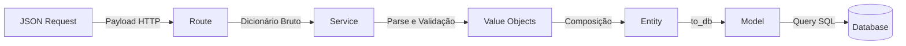
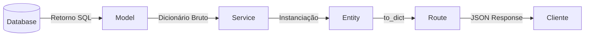

# Arquitetura do Backend

## Visão Geral

O Backend do projeto foi arquitetado utilizando **Python com Flask**, incorporando conceitos fundamentais de **Domain-Driven Design (DDD)** e **Clean Architecture**, adaptados à complexidade e escala da aplicação. O princípio basilar desta arquitetura estabelece que **nenhum dado ingressa nas camadas de negócio sem prévia instanciação em objetos de domínio**, e, de forma simétrica, a saída de dados demanda processos estritos de serialização (de objetos para JSON/dicionários).

Essa padronização certifica que a aplicação está protegida contra a manipulação direta de strings brutas originadas de requisições HTTP. Entidades de negócio (como placas de veículos, endereços de e-mail ou telemetria de bateria) possuem existência sistêmica validada tão logo transponham a barreira de roteamento, garantindo isolamento e previsibilidade.

---

## Por que Flask?

Flask foi escolhido por ser o framework com o qual **todos os integrantes da equipe já tinham familiaridade**. Em um projeto de equipe com prazo definido, o custo de aprendizado de um novo framework (como FastAPI ou Django) seria maior do que os benefícios técnicos que ele traria. Flask oferece o mínimo necessário sem impor uma estrutura rígida, o que permitiu que a arquitetura DDD fosse desenhada livremente, sem conflitar com convenções do framework.

---

##  Prevenção por Tipagem e Encapsulamento

###  A vulnerabilidade do acoplamento e o "Primitive Obsession"

Imagine que o front-end envie o seguinte JSON para cadastrar um novo drone:

```json
{
  "nome": "Drone Alpha",
  "status_voo": "voando_muito_alto", 
  "bateria": 150
}
```

Em arquiteturas MVC tradicionais simplificadas, é comum vermos um acoplamento direto entre o payload HTTP (tipos primitivos como strings e inteiros) e a persistência de dados:

```python
# Abordagem acoplada e vulnerável
@app.route('/drones', methods=['POST'])
def criar_drone():
    data = request.get_json()
    
    # O dado transita da rede DIRETAMENTE para o banco de dados
    # "voando_muito_alto" vira uma string no banco. Bateria 150 vira um inteiro.
    db.execute("INSERT INTO drones (nome, status_voo, bateria) VALUES (%s, %s, %s)",
               (data['nome'], data['status_voo'], data['bateria'])) 
    
    return jsonify({"msg": "Sucesso!"})
```

**O problema:** À primeira vista, o código funcionou. O banco de dados aceitou uma string qualquer no status e um inteiro qualquer na bateria. Mas o sistema acaba de ser **corrompido silenciosamente**.

Semanas depois, outro serviço tenta iterar sobre os drones para calcular o tempo de voo restante. Ele confia que a bateria será um número até 100. A bateria `150` causa um `ZeroDivisionError` ou gera um tempo de voo negativo. O dashboard do front-end quebra porque não tem um ícone mapeado para o status `"voando_muito_alto"`. 

O desenvolvedor precisa então investigar: *"De onde veio esse dado? Foi um erro de digitação do usuário? Foi um bug no sensor do drone? Em que momento isso foi inserido?"*. A falha só se manifesta muito tempo depois e em um lugar completamente diferente do sistema. Isso é o resultado de trafegar **tipos primitivos** sem validação — um anti-pattern conhecido como *Primitive Obsession*.

### A Solução: Blindagem nas Bordas (Fail-Fast)

Na nossa arquitetura baseada em DDD, o princípio é: **"Não confiamos em dados que chegam da internet. Apenas objetos de domínio instanciados são confiáveis."**

A entrada de dados exige a transição obrigatória por **Value Objects**. Veja como o mesmo cenário ocorre no nosso backend:

1. O payload bate na rota e é enviado em estado bruto ao Service.
2. O Service tenta converter os dados brutos nos respectivos tipos do sistema:
   - `DroneNome("Drone Alpha")` -> *Sucesso.*
   - `DroneStatusVoo("voando_muito_alto")` -> **Falha Imediata.** O `Value Object` sabe que os únicos status válidos são `em_voo`, `pousado` ou `offline`.
   - `DroneBateria(150)` -> **Falha Imediata.** O `Value Object` lança uma exceção pois bateria máxima é 100.

O processamento é abortado milissegundos após a requisição chegar. Uma exceção `ValueError` é lançada, e o usuário recebe um erro claro: `400 Bad Request - Bateria não pode exceder 100%`. O dado corrompido sequer chega perto de acionar a conexão com o banco de dados.

Uma vez que um `Drone` é instanciado em nosso código, qualquer outra camada sabe que ele é válido. Não precisamos ficar fazendo "if bateria > 100" espalhados por todo o código. O encapsulamento garante a integridade desde o momento do nascimento do objeto.

**Veja como isso fica no código:**

```python
# Abordagem baseada em DDD (Fail-Fast)

# 1. O Value Object blinda a informação (app/entities/drone_entity.py)
class DroneBateria:
    def __init__(self, bateria: int):
        if not (0 <= bateria <= 100):
            # A exceção é lançada no milissegundo em que o objeto tenta nascer
            raise ValueError("Bateria não pode exceder 100%")
        self._valor = bateria
        
    def get_value(self):
        return self._valor

# 2. A Rota intercepta o erro (app/routes/drone_route.py)
@app.route('/drones', methods=['POST'])
def criar_drone():
    data = request.get_json()
    try:
        # 3. O Service orquestra a conversão (app/services/drone_service.py)
        # Se 'data["bateria"]' for 150, a linha abaixo lança a exceção e aborta a execução
        bateria_segura = DroneBateria(data['bateria'])
        
        # O banco de dados só é acionado se todos os Value Objects sobreviverem à instanciação
        DroneModel.insert(nome=data['nome'], bateria=bateria_segura.get_value())
        
        return jsonify({"msg": "Sucesso!"}), 201
    except ValueError as e:
        # O cliente recebe o 400 Bad Request IMEDIATAMENTE
        return jsonify({"message": str(e)}), 400
```

### Fluxo de Comunicação entre as Camadas

Para ilustrar de forma visual como essa arquitetura atua como um "funil de validação", observe os diagramas abaixo. 

No **Fluxo de Escrita (Recebendo Dados)**, perceba como os dados brutos oriundos da internet são transformados, purificados e organizados camada por camada até chegarem de forma totalmente segura no banco de dados:



O caminho reverso (leitura e formatação de resposta) segue fluxo inverso:



Em síntese:
- **Entrada (Ingress):** Desserialização controlada (Raw Data → Objeto Validado).
- **Saída (Egress):** Serialização canônica (Objeto → Dicionário Python → JSON).

---

## Organização de Diretórios

### Os Problemas Reais do nosso MVC Clássico

No início do desenvolvimento, adotamos a abordagem mais rápida e comum: as Rotas recebiam os dados HTTP brutos e repassavam diretamente para os arquivos na pasta `models/`. 

No entanto, rapidamente esbarramos em um problema grave de acúmulo de responsabilidades. Os nossos Models estavam tentando fazer tudo ao mesmo tempo, gerando um código difícil de dar manutenção:

1. **Models "Faz-Tudo" :** Arquivos como `OperacaoModel` não eram apenas uma interface de persistência. Eles recebiam as strings puras da rede, validavam se a string não estava vazia e se cumpria os tamanhos mínimos (papel de *Value Object*), gerenciavam as regras lógicas de negócio como auditorias e cruzamento de dados (papel de *Service*) e, no fim de tudo, montavam a query SQL.
2. **Lógica Presa e Duplicada:** A validação de "o nome precisa ter mais de 3 letras" estava presa dentro do comando `insert()` do Model. Se em outra parte do código precisássemos alterar o nome de algo, a mesma validação tinha que ser escrita de novo, gerando risco de inconsistência.


### A Divisão de Responsabilidades (Migrando para Camadas)

Para resolver o caos de misturar protocolo HTTP com regras de negócio e queries SQL, nós "quebramos" a aplicação em pastas especializadas. Cada pasta tem um papel único e proibido de fazer o trabalho da outra:

- **`routes/` (Os Controladores HTTP):** Só entende de HTTP. Pega o JSON, envia para o Service, e devolve a resposta HTTP (200, 400). Não toma nenhuma decisão de negócio e não sabe o que é uma query SQL.
- **`services/` (Os Orquestradores):** É aqui que a lógica de negócio mora. Ele pega o pedido da Rota, tenta transformar em objetos do mundo real (Entities) e, se tudo der certo, manda para os Models salvarem. Podem ser reutilizados por qualquer outra interface (como um script de automação).
- **`entities/` (As Regras de Vida Real):** Arquivos Python purinhos, sem importação de Flask ou bibliotecas de banco. Onde definimos o que é um Drone, quais os seus limites físicos e estados.
- **`models/` (A Persistência):** A única camada que sabe falar a linguagem SQL. Não toma decisões. Simplesmente recebe comandos do Service e executa no PostgreSQL.

Essa é a razão exata da nossa estrutura física refletir a seguinte hierarquia:

```text
Backend/
└── app/
    ├── entities/       # Contratos estruturais do domínio (Value Objects e Entidades Puras)
    ├── models/         # Interações exclusivas com o banco de dados (Infraestrutura)
    ├── services/       # Aplicação de regras de negócio, parsers e orquestração
    ├── routes/         # Controladores HTTP (Adapters para entrada/saída)
    └── middleware/     # Interceptadores (Decoupled RBAC, tratamento de tokens)
```

Nesta hierarquia, a injeção de dependências ocorre estritamente de fora para dentro. Uma Rota aciona um Serviço, que orquestra Entidades e delega persistência a um Model. A Entidade, localizada no núcleo, desconhece o protocolo HTTP ou a tecnologia do banco de dados subjacente.

---


## Identificadores Descentralizados (UUID gerado no Python)

Ao invés de dependermos nativamente das engines do PostgreSQL para a determinação e sequenciamento de IDs primários em formato `gen_random_uuid()`, transacionou-se esse comportamento para o escopo lógico da classe construtora no core do domínio (usando `uuid.uuid4()`).

**Justificativa Técnica e Arquitetural:** Na cultura de Domain-Driven Design, uma entidade necessita deter identidade autônoma no exato momento da alocação de sua memória. O dado detém um registro imutável antes mesmo de se submeter ou depender ativamente que uma transação de inserção de banco responda um retorno com seu novo ID gerado.

Esse pilar acelera substancialmente e viabiliza referências em memórias ativas e complexas, além da criação e testagem assertiva atreladas à Mockups, descartando a obrigatoriedade da integração online constante de infraestrutura do DB durante testes.

---

## Middleware — Controle de Acessos (`middleware/`)

A autorização (comportamento de validação Role Based Access Control) desvincula eficientemente a verificação e lógica de perfil do serviço restrito. O decorador padronizado `@role_required` restringe e rejeita os acessos escrutinando rigorosamente a carga estrutural do Token, abortando transações e sinalizando nativamente um retorno `403 Forbidden` sem sequer poluir o fluxo dos `services`.

