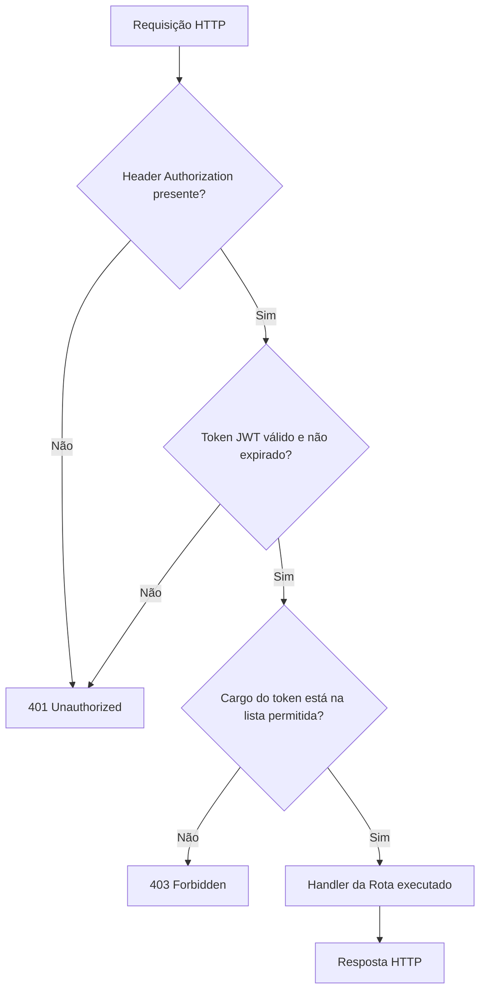

# Middleware e Autorização

A camada de **Middleware** contém os interceptadores que atuam antes de qualquer handler de rota ser executado. No contexto desta aplicação, ela é responsável pelo controle de acesso baseado em cargos — **RBAC (Role-Based Access Control)**.

Toda a lógica está concentrada em um único arquivo: `middleware/decorators.py`.

---

## Como o Sistema de Autorização Funciona

O Flask possui um mecanismo chamado **decorators**, que permite envolver uma função de rota com lógica executada antes (e/ou depois) do handler. O sistema de autenticação utiliza dois decorators empilhados:

```python
@jwt_required()       # 1º: Verifica se o token JWT existe e é válido (fornecido pelo flask-jwt-extended)
@role_required(...)   # 2º: Verifica se o cargo dentro do token tem permissão para esta rota
def minha_rota():
    ...
```

A ordem importa: `@jwt_required()` sempre vem primeiro porque `@role_required` depende dos claims do JWT para funcionar. Se o token for inválido ou estiver ausente, o Flask retorna `401 Unauthorized` antes mesmo de chegar ao `@role_required`.

---

## `decorators.py` — O Decorator `@role_required`

```python title="app/middleware/decorators.py"
from functools import wraps
from flask import jsonify
from flask_jwt_extended import get_jwt

def role_required(*allowed_roles):
    """
    Decorator de autorização genérico.
    Aceita um ou mais cargos como argumentos e bloqueia qualquer cargo fora da lista.
    Exemplo de uso: @role_required('gestor_remoto', 'gestor_local')
    """
    def wrapper(fn):
        # @wraps preserva o nome e docstring da função original
        # Sem isso, todas as rotas decoradas teriam o nome 'decorator', quebrando o Flask
        @wraps(fn)
        def decorator(*args, **kwargs):
            # get_jwt() lê o payload decodificado do token JWT da requisição atual
            # O cargo foi embutido nos claims no momento do login via create_access_token
            claims    = get_jwt()
            user_role = claims.get('role')

            # Compara o cargo do token contra a lista de cargos permitidos para esta rota
            if user_role not in allowed_roles:
                # Retorna 403 Forbidden com detalhes — útil para depuração no frontend
                return jsonify({
                    'message':          'Acesso negado. Você não tem permissão para entrar aqui.',
                    'seu_cargo':        user_role,        # Cargo atual do usuário
                    'cargos_permitidos': allowed_roles    # Cargos que teriam acesso
                }), 403

            # Cargo autorizado — passa o controle para o handler da rota
            return fn(*args, **kwargs)
        return decorator
    return wrapper
```

---

## Tabela de Cargos e Permissões

O sistema possui dois cargos, cada um com um conjunto de rotas permitidas:

| Cargo | Descrição | Permissões |
|---|---|---|
| `gestor_remoto` | Administrador do sistema | Acesso total — leitura, escrita, exclusão e criação |
| `gestor_local` | Operador de campo | Acesso de leitura — consultas, validações de scans |

---

## Referência de Uso por Domínio

### Rotas exclusivas de `gestor_remoto`
Operações de escrita sensíveis, como criação de novos recursos e alteração de dados críticos:

```python
@role_required('gestor_remoto')   # Criação de operações, drones e veículos
@role_required('gestor_remoto')   # Registro de novos usuários (auth/register)
```

### Rotas compartilhadas
Consultas e validações que ambos os cargos podem executar:

```python
@role_required('gestor_remoto', 'gestor_local')   # Listagens, buscas, validação de scans
```

### Rotas sem restrição de cargo
Qualquer usuário autenticado (JWT válido) pode acessar, independente do cargo:

```python
@jwt_required()   # Atualização de localização de drone, perfil próprio (/users/me)
```

---

## Fluxo Completo de uma Requisição Protegida



---

## Como o Cargo Chega ao Token

O cargo é embutido no momento do login em `user_service.py`, usando o parâmetro `additional_claims` do `flask-jwt-extended`:

```python
token = create_access_token(
    identity=user.get_id(),                     # UUID do usuário como subject do JWT
    additional_claims={'role': user.get_role()} # Cargo embutido no payload do token
)
```

Quando `@role_required` é acionado em uma requisição subsequente, ele lê esse mesmo campo via `get_jwt()['role']` — sem nenhuma consulta ao banco, tornando a verificação de autorização completamente stateless.
