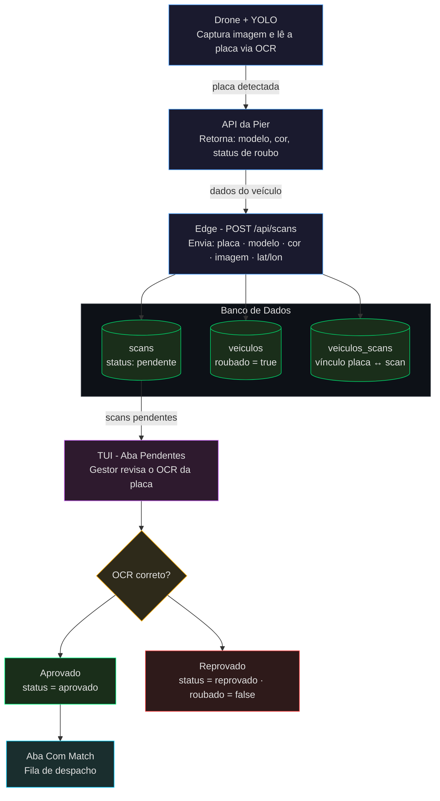

# PIER TUI - Painel de Controle Operacional

## Por que uma TUI?

A CLI entregue na Sprint 2 funcionava (no sentido mais básico da palavra). Ela se comunicava com a API, listava dados e executava comandos. Mas parava por aí.

Na prática, usar a CLI era uma experiência frustrante. Para qualquer operação, o usuário precisava lembrar o comando exato, a ordem correta dos argumentos e as flags disponíveis, sem nenhum feedback visual sobre o que estava fazendo. Listar veículos despejava um bloco de JSON bruto no terminal. Criar um scan exigia montar o comando na cabeça. Navegar entre funcionalidades significava digitar e redigitar. Não havia estado, não havia contexto, não havia fluxo: cada comando era uma ilha.

Para um sistema de vigilância operacional, isso era inaceitável. A proposta do projeto é simular um painel que um gestor usaria de verdade: acompanhar drones em voo, revisar scans de placas suspeitas, tomar decisões críticas em tempo real. Uma CLI com `--flags` e muros de texto não serve para isso. Ela esconde a informação em vez de apresentá-la.

Por isso na Sprint 3 jogamos a CLI fora e construímos uma **TUI (Terminal User Interface)** do zero: uma interface que ainda roda no terminal, mas com abas, formulários, botões e cards de informação organizados. Usamos o framework [Textual](https://textual.textualize.io/), que permite construir interfaces ricas inteiramente em Python, sem dependência de navegador ou display gráfico.

---

## Por que Textual?

A escolha do [Textual](https://textual.textualize.io/) foi direta: é um framework Python que permite construir interfaces de terminal com o mesmo modelo mental de um framework web, com componentes, eventos e CSS para estilização, sem abrir mão da portabilidade do terminal. Não exige servidor, não exige browser, roda em qualquer máquina com Python.

Outras opções existem (`curses`, `urwid`, `prompt_toolkit`), mas o Textual foi o que melhor equilibrou produtividade e resultado visual. Com ele foi possível criar abas, botões, formulários modais e cards de dados em Python puro, com reatividade baseada em eventos, muito mais próximo de desenvolver uma interface de verdade do que escrever cursores manualmente.

---

## Estrutura Geral da Interface

Após o login, a **MainScreen** é exibida. A navegação é organizada em cinco abas na barra superior, cada uma cobrindo um domínio específico do sistema:

| Aba | Ações disponíveis |
|:---|:---|
| **Veículos** | Listar, buscar por placa, registrar roubados, deletar |
| **Operações** | Listar, criar, alterar status, deletar |
| **Drones** | Listar, filtrar em voo, registrar, atualizar localização, deletar |
| **Scans** | Listar, Pendentes (OCR), Com Match (alertas), Criar, Validar, Vincular, Histórico, Deletar |
| **Usuários** | Listar, buscar por nome, ver perfil, criar, alterar senha, deletar |

Cada aba possui uma **barra de botões** que dispara as ações. O resultado é exibido na área central como **DataCards**: painéis individuais com os dados em formato chave/valor, substituindo as tabelas brutas da CLI.

---

## O Pipeline de Detecção

O principal diferencial da TUI nesta etapa é ser o **ponto de controle humano** dentro de um pipeline automatizado de detecção de veículos roubados. O operador não precisa iniciar nada manualmente: os dados chegam do campo e a TUI os apresenta organizados, aguardando uma decisão.

O fluxo completo funciona assim:



---

## Como a TUI se Comunica com o Backend

Não tem muito segredo. Toda a comunicação passa por uma função central, `api_request`, que envolve a biblioteca `requests` e injeta automaticamente o token JWT em cada chamada:

```python
def api_request(method: str, endpoint: str, data: dict | None = None, require_auth: bool = True):
    url = f"{BASE_URL}{endpoint}"
    headers = {"Content-Type": "application/json"}
    if require_auth:
        token = load_session()
        if token:
            headers["Authorization"] = f"Bearer {token}"
    try:
        response = requests.request(method, url, headers=headers, json=data, timeout=10)
        res_json = response.json()
        if not response.ok:
            msg = res_json.get("message", res_json.get("msg", "Erro na requisição"))
            return {"error": True, "status": response.status_code, "message": msg}
        return res_json
    except Exception as e:
        return {"error": True, "message": str(e)}
```

Cada ação da interface chama essa função diretamente. Por exemplo, ao carregar a fila de pendentes ou ao gestor aprovar/reprovar um scan:

```python
def load_scans_pending(self) -> None:
    res = api_request("GET", "/api/scans/pendentes")
    # monta os ValidationCards com os dados retornados
    for s in data:
        container.mount(ValidationCard(s))

def on_validation_card_aprovar(self, event: ValidationCard.Aprovar) -> None:
    res = api_request("PATCH", f"/api/scans/{event.scan_id}/validar",
                      {"status_validacao": "aprovado"})

def on_validation_card_rejeitar(self, event: ValidationCard.Rejeitar) -> None:
    res = api_request("PATCH", f"/api/scans/{event.scan_id}/validar",
                      {"status_validacao": "rejeitado"})
```

O modelo é simples: o Textual captura o evento do botão (ex: `ValidationCard.Aprovar`), o handler correspondente chama `api_request` com o método e endpoint certos, e o resultado é refletido na interface, seja atualizando os cards ou exibindo uma mensagem de erro.

---

## Autenticação

Ao abrir a TUI, o sistema verifica automaticamente se existe uma sessão salva em `~/.pier_session`. Caso não exista (ou o token esteja expirado), a tela de login é exibida:


O operador insere e-mail e senha. A TUI chama `POST /api/auth/login`, recebe o token JWT e o persiste localmente. A partir daí, todas as requisições são autenticadas de forma transparente, sem que o operador precise se preocupar com cabeçalhos ou tokens. Se o token expirar durante a sessão, a tela de login reaparece automaticamente.

---

## Telas em Destaque

As capturas abaixo ilustram as telas mais utilizadas pelo gestor no dia a dia, as etapas centrais do fluxo de detecção e validação. A TUI possui outras telas além dessas, cobrindo o gerenciamento de veículos, operações, drones e usuários, mas as apresentadas aqui são o núcleo da operação de campo.

### Pendentes: Validação de OCR

A aba **Pendentes** exibe todos os scans que ainda aguardam revisão humana. Para cada entrada, o gestor vê a imagem capturada pelo drone, a placa lida automaticamente pelo OCR e os dados retornados pela API da Pier (modelo e cor do veículo).


A decisão é simples: confirmar que o OCR foi preciso ou rejeitar caso a leitura esteja errada. Scans aprovados avançam no pipeline; rejeitados ficam salvos com status reprovado.

### Com Match: Alertas para Despacho

Scans aprovados com veículos marcados como roubados na base da Pier aparecem na aba **Com Match**. Essa é a fila de despacho: o gestor visualiza a placa confirmada, a localização GPS do drone no momento da captura e os dados do veículo.


A separação entre "Pendentes" e "Com Match" é intencional: evita que alertas não verificados se misturem com confirmações reais, reduzindo ruído operacional e falsos positivos.
