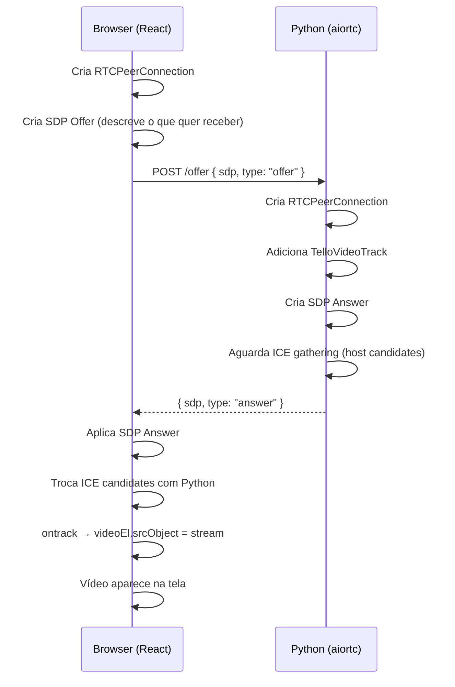
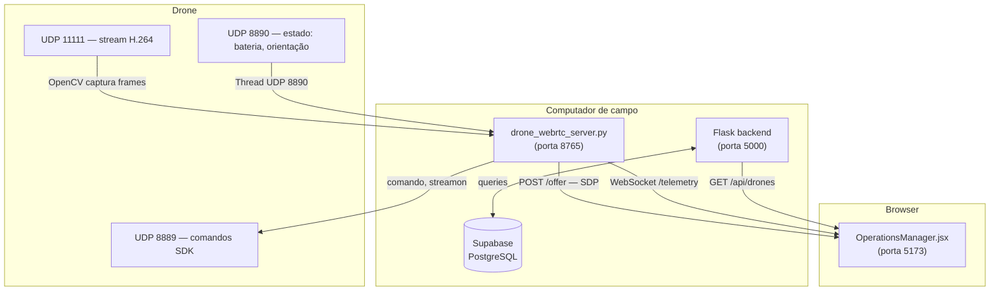

# Transmissão de Vídeo com WebRTC

&emsp; Na Sprint 4, o sistema passou a transmitir o vídeo ao vivo do drone DJI Tello diretamente para a interface web do Gestor de Operação (`OperationsManager`), eliminando a dependência de uma janela local do OpenCV. Além do vídeo, dados de telemetria — bateria, conectividade e status do drone — passaram a ser enviados em tempo real pelo protocolo WebSocket, com detecção automática de desconexão do drone.

&emsp; Esta documentação descreve como a tecnologia WebRTC funciona, como ela foi integrada à arquitetura do projeto e quais dificuldades foram encontradas e resolvidas durante o desenvolvimento.

---

## Como o WebRTC Funciona

&emsp; **WebRTC** (*Web Real-Time Communication*) é um conjunto de padrões abertos que permite a troca de áudio, vídeo e dados arbitrários entre navegadores e aplicações de forma direta (*peer-to-peer*), sem necessidade de plugin ou servidor intermediário para o tráfego de mídia.

### Componentes principais

&emsp; A tecnologia é composta por três APIs centrais:

- **`RTCPeerConnection`** — gerencia toda a conexão entre os dois lados (peers), incluindo negociação de codecs, gestão de candidatos ICE e transmissão dos streams de mídia.
- **`RTCSessionDescription` (SDP)** — descreve as capacidades de cada peer: codecs suportados, formatos de vídeo, direção da transmissão (enviar, receber ou ambos) e parâmetros de segurança.
- **`ICE` (Interactive Connectivity Establishment)** — protocolo que descobre os caminhos de rede disponíveis entre os dois peers, tentando conexão direta e, quando necessário, passando por servidores STUN ou TURN como intermediários.

### O processo de negociação (Signaling)

&emsp; Antes de qualquer mídia trafegar, os dois peers precisam se "apresentar". Esse processo é chamado de **sinalização** (*signaling*) e não está padronizado pelo WebRTC — cabe à aplicação implementar o canal de troca de mensagens. No caso deste projeto, o canal de sinalização é uma requisição HTTP (`POST /offer`) ao servidor Python.

&emsp; O fluxo de negociação segue as etapas abaixo:



### ICE e a topologia de rede do projeto

&emsp; O ICE testa múltiplos caminhos de rede para estabelecer a conexão. Cada caminho candidato é chamado de **ICE candidate**. Existem três tipos:

- **host** — endereço IP diretamente na interface de rede local.
- **srflx** (*server reflexive*) — endereço público obtido via servidor STUN, usado quando os peers estão atrás de NAT.
- **relay** — endereço de um servidor TURN, usado quando conexão direta é impossível.

&emsp; Neste projeto, o browser e o servidor Python rodam **na mesma máquina** (o computador de campo). Portanto, a conexão ocorre via endereços `host` do tipo `localhost`, sem necessidade de STUN ou TURN. O `RTCPeerConnection` é configurado com `iceServers: []` para refletir isso.

---

## Arquitetura da Implementação

&emsp; A Sprint 4 introduziu um novo processo, o `drone_webrtc_server.py`, que roda no computador de campo ao lado do backend Flask. Na integração final com a branch de conectividade, esse processo deixou de usar IPs e portas fixos e passou a carregar a mesma configuração centralizada de `src/network_routes.py`, preservando as variáveis `TELLO_*`, o preflight de portas/firewall e a URL de vídeo validada `udp://@0.0.0.0:11111`. Ele concentra toda a comunicação com o drone Tello e expõe dois endpoints para o frontend:



&emsp; A topologia de rede usa **duas interfaces de rede simultâneas** no computador de campo:

- **Interface Wi-Fi do Tello** — conectada ao SSID `TELLO-XXXXXX`, usada para comando, telemetria e vídeo UDP.
- **Interface com Internet** — dongle Wi-Fi USB, cabo/Ethernet, iPhone USB ou outro adaptador, usada pelo Flask, APIs e banco de dados.

---

## Como Cada Componente Funciona

### `drone_webrtc_server.py` — o servidor de campo

&emsp; Este processo é responsável por três funções simultâneas:

#### 1. Captura de vídeo (`TelloVideoTrack`)

&emsp; A classe `TelloVideoTrack` estende `VideoStreamTrack` da biblioteca `aiortc`. O método `recv()` é chamado automaticamente pelo aiortc toda vez que um novo frame precisa ser enviado ao browser. Dentro de `recv()`, a leitura do OpenCV (`cv2.VideoCapture`) é executada em um executor de threads separado para não bloquear o loop de eventos do asyncio:

```python title="src/drone_webrtc_server.py"
async def recv(self):
    pts, time_base = await self.next_timestamp()

    loop = asyncio.get_running_loop()
    bgr_frame = await loop.run_in_executor(self._executor, self._read_frame_blocking)

    rgb_frame = cv2.cvtColor(bgr_frame, cv2.COLOR_BGR2RGB)
    video_frame = VideoFrame.from_ndarray(rgb_frame, format="rgb24")
    video_frame.pts = pts
    video_frame.time_base = time_base
    return video_frame
```

&emsp; O método `next_timestamp()`, fornecido pela superclasse `VideoStreamTrack`, retorna o par `(pts, time_base)` no formato correto exigido pelo PyAV — um `Fraction` representando a base de tempo RTP de 90 kHz, padrão para vídeo WebRTC.

#### 2. Leitura de estado do drone (`_state_receiver_loop`)

&emsp; O Tello transmite automaticamente seu estado via UDP na porta 8890 a cada aproximadamente 100 ms assim que entra em modo SDK. A string de estado tem o formato:

```
pitch:0;roll:0;yaw:0;vgx:0;vgy:0;vgz:0;templ:60;temph:62;tof:10;h:0;bat:90;baro:73.07;time:0;agx:-10.00;agy:7.00;agz:-998.00;
```

&emsp; Uma thread dedicada escuta essa porta e atualiza o estado global `_drone_state`, incluindo bateria (`bat`) e se o drone está em voo (derivado da altura `h`). O timestamp do último pacote recebido é armazenado em `_last_state_time` e serve como mecanismo de **detecção de desconexão**: se nenhum pacote chegar por mais de 3 segundos, o drone é considerado offline.

#### 3. Sinalização WebRTC e telemetria (`handle_offer`, `handle_telemetry`)

&emsp; O endpoint `POST /offer` recebe o SDP offer do browser, cria um `RTCPeerConnection`, adiciona o `TelloVideoTrack` como fonte de vídeo, gera o SDP answer e aguarda o ICE gathering completar antes de responder:

```python title="src/drone_webrtc_server.py"
await pc.setRemoteDescription(offer)
answer = await pc.createAnswer()
await pc.setLocalDescription(answer)

await asyncio.wait_for(ice_complete.wait(), timeout=10.0)
```

&emsp; O endpoint WebSocket `GET /telemetry` envia, a cada segundo, um JSON com os dados do drone e o estado da conexão:

```json
{
  "battery": "87%",
  "connectivity": "Wi-Fi",
  "status": "em_voo",
  "drone_connected": true
}
```

---

### `droneStream.js` — o cliente WebRTC no browser

&emsp; O módulo `src/frontend/src/services/droneStream.js` encapsula toda a lógica de cliente WebRTC e WebSocket, expondo uma única função `startDroneStream(videoEl, onTelemetry, onStatus)` que retorna uma função de cleanup para uso em `useEffect`.

&emsp; A configuração do `RTCPeerConnection` usa `iceServers: []` porque browser e servidor estão na mesma máquina — candidatos do tipo `host` (localhost) são suficientes:

```javascript title="src/frontend/src/services/droneStream.js"
pc = new RTCPeerConnection({ iceServers: [] })
pc.addTransceiver('video', { direction: 'recvonly' })

pc.ontrack = (event) => {
  if (videoEl && event.streams[0]) {
    videoEl.srcObject = event.streams[0]
  }
}
```

&emsp; O WebSocket de telemetria conecta-se a `ws://localhost:8765/telemetry` e inclui reconexão automática com intervalo de 3 segundos para o caso de interrupção momentânea do servidor.

---

### `OperationsManager.jsx` — a interface

&emsp; O painel de vídeo da tela do Gestor de Operação apresenta quatro estados visuais distintos:

| Estado | Condição | O que aparece |
|--------|----------|---------------|
| Conectando | `streamStatus === 'connecting'` | Ícone giratório + "Conectando ao servidor..." |
| Servidor offline | `streamStatus === 'offline'` | Texto "Sem sinal" em cinza |
| Drone desconectado | `streamStatus === 'connected'` && `drone_connected === false` | Overlay escuro amarelo: "Drone desconectado" |
| Transmissão ao vivo | `streamStatus === 'connected'` && `drone_connected === true` | Vídeo + badge verde "● AO VIVO" |

&emsp; Os cards de telemetria (Bateria, Conectividade, Drone ID) usam os dados em tempo real do WebSocket quando disponíveis, com fallback automático para os dados da API REST. Um indicador verde pulsante no label do card distingue visualmente dados ao vivo de dados estáticos.

---

## Dificuldades Encontradas e Soluções

### 1. Classe base incorreta no `aiortc`

**Problema:** A classe `TelloVideoTrack` foi inicialmente escrita herdando de `MediaStreamTrack` importado de `aiortc.contrib.media`. Esse módulo não exporta `MediaStreamTrack` de forma confiável, e a classe não fornecia o método `next_timestamp()`, que é essencial para gerar o par `(pts, time_base)` no formato correto do PyAV.

**Solução:** A classe passou a herdar diretamente de `VideoStreamTrack` importado de `aiortc`:

```python
from aiortc import RTCPeerConnection, RTCSessionDescription, VideoStreamTrack
```

&emsp; `VideoStreamTrack` já define `kind = "video"` e fornece `next_timestamp()`, que retorna um objeto `Fraction` como `time_base` — o formato que o PyAV exige para encapsular frames de vídeo corretamente.

---

### 2. `time_base` como string causava frames inválidos

**Problema:** O `time_base` do `VideoFrame` foi definido manualmente como uma string (`"1/90000"`). O PyAV não aceita strings nessa propriedade — espera um objeto `fractions.Fraction`. Isso fazia com que os frames fossem descartados internamente, resultando em vídeo nunca exibido no browser mesmo após a conexão WebRTC ser estabelecida.

**Solução:** Ao usar `next_timestamp()` da superclasse `VideoStreamTrack`, o par `(pts, time_base)` já é retornado com os tipos corretos, eliminando a necessidade de construir o `time_base` manualmente.

---

### 3. Timeout de 30 segundos do FFmpeg travando o servidor

**Problema:** `cv2.VideoCapture("udp://@0.0.0.0:11111", cv2.CAP_FFMPEG)` pode bloquear a thread por até 30 segundos esperando dados UDP quando o drone ainda não está transmitindo. Como não havia throttle de retry, o código tentava reabrir o stream imediatamente após cada falha, criando um loop de tentativas de 30 segundos cada:

```
[ WARN ] Stream timeout triggered after 30014.239000 ms
WARNING Não foi possível abrir o stream do Tello.
INFO    Abrindo stream UDP do Tello em udp://@0.0.0.0:11111...
[ WARN ] Stream timeout triggered after 30014.239000 ms
...
```

**Solução:** Duas mudanças combinadas resolveram o problema:

1. O parâmetro `timeout=5000000` foi adicionado à URL do stream (valor em microssegundos), reduzindo o timeout do FFmpeg de 30 s para 5 s:

```python
TELLO_VIDEO_URL = load_tello_config().video_url
```

&emsp;Por padrão, `src/network_routes.py` monta `udp://@0.0.0.0:11111`, que foi a URL validada no teste de streaming ao vivo do Tello. Caso necessário, a operação pode sobrescrever esse valor por `TELLO_VIDEO_URL`.

2. Um throttle de 5 segundos entre tentativas foi adicionado à lógica de `_read_frame_blocking`, evitando que o código chamasse `_open_capture()` imediatamente após uma falha. Além disso, o servidor passou a reenviar automaticamente os comandos `command` e `streamon` a cada três tentativas falhas, cobrindo o caso em que o drone não recebeu os comandos iniciais:

```python
if self._failed_opens == 1 or self._failed_opens % self._RESEND_EVERY == 0:
    _send_command("command")
    time.sleep(0.3)
    _send_command("streamon")
```

---

### 4. Erros H.264 no início do stream

**Problema:** Ao abrir o stream UDP no meio da transmissão H.264 do Tello, os primeiros frames chegam sem o cabeçalho SPS/PPS necessário para o decoder inicializar. O FFmpeg registrava mensagens de erro como:

```
[h264] non-existing PPS 0 referenced
[h264] decode_slice_header error
[h264] no frame!
```

**Solução:** Esses erros são inerentes ao protocolo UDP com H.264 e não representam falha do sistema. Assim que o Tello envia um *keyframe* (IDR frame), o decoder sincroniza automaticamente e os erros cessam. Não é necessária nenhuma alteração de código — apenas documentar o comportamento esperado. Na prática, o vídeo aparece no browser após 1 a 3 segundos do início do stream.

---

### 5. Vídeo oculto porque `droneConnected` começava como `null`

**Problema:** A condição de exibição do elemento `<video>` era `streamStatus === 'connected' && droneConnected`. Como `droneConnected` vem de `liveTelemetry.drone_connected`, que começa como `null` (estado inicial antes do primeiro pacote do WebSocket), a expressão JS avaliava `'connected' && null` → `null` (falsy), mantendo o elemento sempre oculto. O vídeo nunca aparecia na tela, mesmo com o stream WebRTC funcionando corretamente.

**Solução:** A condição de exibição do `<video>` foi simplificada para depender apenas do `streamStatus`, separando a visibilidade do vídeo da informação de conectividade do drone:

```jsx
display: streamStatus === 'connected' ? 'block' : 'none'
```

&emsp; O overlay "Drone desconectado" passou a usar verificação de igualdade estrita `droneConnected === false`, que só ativa quando o valor é explicitamente `false` — não quando é `null`. Os badges e overlays secundários usam `=== true` pelo mesmo motivo.

---

### 6. Campo `drone_connected` não chegava ao React

**Problema:** O servidor Python enviava corretamente o campo `drone_connected` no JSON do WebSocket. Porém, em `droneStream.js`, o callback `onTelemetry` construía o objeto manualmente, listando apenas `battery`, `connectivity` e `status`. O campo `drone_connected` simplesmente não era incluído, fazendo com que `liveTelemetry.drone_connected` ficasse permanentemente `null`:

```javascript
// Código com o bug:
onTelemetry({
  battery: data.battery ?? null,
  connectivity: data.connectivity ?? null,
  status: data.status ?? null,
  // drone_connected ausente
})
```

**Solução:** O campo foi adicionado ao objeto passado para `onTelemetry`:

```javascript
onTelemetry({
  battery: data.battery ?? null,
  connectivity: data.connectivity ?? null,
  status: data.status ?? null,
  drone_connected: data.drone_connected ?? null,
})
```

---

### 7. Overlay de desconexão invisível sobre tela preta

**Problema:** Quando o drone desligava, o overlay "Drone desconectado" era renderizado sobre o elemento `<video>`, que exibia frames pretos (OpenCV retornando `None`, substituído por frame vazio). O overlay não tinha fundo definido, tornando seu texto invisível sobre o fundo preto.

**Solução:** O overlay recebeu um fundo semi-opaco escuro para garantir legibilidade independentemente do conteúdo do vídeo:

```jsx
background: 'rgba(0, 0, 0, 0.72)'
```

---

## Como Rodar

```bash
# 1. Preparar ou validar o ambiente Python local
powershell -ExecutionPolicy Bypass -File .\scripts\setup_tello_cli_env.ps1

# 2. Aplicar a regra de firewall em PowerShell como Administrador
powershell -ExecutionPolicy Bypass -File .\scripts\enable_tello_video_firewall_rule.ps1

# 3. Conectar uma interface Wi-Fi ao Tello (SSID: TELLO-XXXXXX)
#    Manter uma segunda interface com Internet

# 4. Iniciar o servidor WebRTC com preflight
powershell -ExecutionPolicy Bypass -File .\scripts\run_tello_webrtc_server.ps1

# 5. Iniciar o backend Flask
python src/backend/main.py

# 6. Iniciar o frontend
cd src/frontend && npm run dev
```

&emsp; Ao acessar a tela do Gestor de Operação no Vite local, a transmissão de vídeo e a telemetria iniciam automaticamente. As URLs usadas pelo frontend podem ser ajustadas por `VITE_DRONE_WEBRTC_URL` e `VITE_DRONE_TELEMETRY_WS_URL`; por padrão, apontam para `http://localhost:8765` e `ws://localhost:8765/telemetry`.

## Evidências da integração

| Verificação | Resultado |
| --- | --- |
| Merge rastreável | A branch `origin/transmicao-Video` foi integrada por merge real na `docs-tello-conectividade`, preservando os commits originais no grafo Git. |
| Imports WebRTC | `.venv\Scripts\python.exe -c "import cv2, aiortc, aiohttp, aiohttp_cors, av; import src.drone_webrtc_server"` executou com `TELLO_VIDEO_URL=udp://@0.0.0.0:11111`, `TELLO_STATE_PORT=8890` e `TELLO_WEBRTC_PORT=8765`. |
| Build do frontend | `npm run build` em `src/frontend` compilou com Vite `5.4.21`, React, Leaflet e `droneStream.js`. |
| Servidor WebRTC | `python -m src.drone_webrtc_server` subiu em `0.0.0.0:8765` e registrou o plano de rede centralizado. |
| Telemetria WebSocket | Probe local recebeu `{"battery": null, "connectivity": "Wi-Fi", "status": "offline", "drone_connected": false}` sem o Tello conectado. |
| Sinalização WebRTC | Probe local enviou uma SDP offer para `POST /offer` e recebeu status `200`, `type=answer` e SDP preenchido. |
| Limite do teste de frontend | O frontend abriu no navegador local e renderizou a tela de login sem erros de console. A tela autenticada completa depende de backend Flask com `.env`/banco local ou credenciais reais. |

---

## Referências

MDN WEB DOCS. **WebRTC API**. Mozilla Developer Network, 2024. Disponível em: https://developer.mozilla.org/en-US/docs/Web/API/WebRTC_API. Acesso em: jun. 2026.

AIORTC. **aiortc: WebRTC and ORTC implementation for Python**. GitHub, 2024. Disponível em: https://github.com/aiortc/aiortc. Acesso em: jun. 2026.

RYZHYK, S. et al. **RFC 8829 — JavaScript Session Establishment Protocol (JSEP)**. IETF, 2021. Disponível em: https://www.rfc-editor.org/rfc/rfc8829. Acesso em: jun. 2026.

IETF. **RFC 8445 — Interactive Connectivity Establishment (ICE)**. IETF, 2018. Disponível em: https://www.rfc-editor.org/rfc/rfc8445. Acesso em: jun. 2026.

RYZHYK, S. et al. **RFC 8835 — Transports for WebRTC**. IETF, 2021. Disponível em: https://www.rfc-editor.org/rfc/rfc8835. Acesso em: jun. 2026.

RYSTAD UNIVERSITY. **DJI Tello SDK 2.0 User Guide**. Ryze Tech, 2019. Disponível em: https://dl-cdn.ryzerobotics.com/downloads/Tello/Tello%20SDK%202.0%20User%20Guide.pdf. Acesso em: jun. 2026.

AIOHTTP. **aiohttp — Asynchronous HTTP Client/Server for asyncio**. Documentação oficial, 2024. Disponível em: https://docs.aiohttp.org. Acesso em: jun. 2026.

PYAV. **PyAV — Pythonic bindings for FFmpeg**. GitHub, 2024. Disponível em: https://github.com/PyAV-Org/PyAV. Acesso em: jun. 2026.
