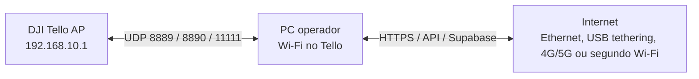
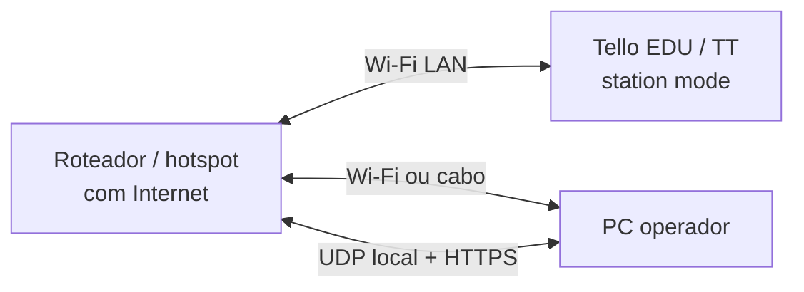

# Investigacao: DJI Tello com Internet Simultanea no PC

## Sintese executiva

&emsp;A pergunta investigada foi se o DJI Tello pode ser usado sem depender apenas da rede local criada pelo drone, mantendo o PC conectado ao drone por UDP e, ao mesmo tempo, conectado a Internet para consultar APIs, sincronizar dados e publicar evidencias.

&emsp;A conclusao tecnica e: **para o Tello comum, nao ha controle direto via Internet ou cloud no SDK oficial; o controle continua sendo local, por UDP, no Wi-Fi do drone**. O caminho viavel para o projeto e manter o PC conectado ao SSID `Tello-XXXXXX` e dar Internet ao mesmo PC por uma segunda interface, como Ethernet, USB tethering de celular, modem 4G/5G ou um segundo adaptador Wi-Fi.

&emsp;Existe uma excecao parcial para **Tello EDU / RoboMaster TT**: o SDK 2.0 possui o comando `ap ssid pass`, que coloca o drone em modo station e conecta o Tello a um ponto de acesso. Porem, essa alternativa depende do hardware EDU/TT e deve ser tratada com cuidado para este projeto, porque a referencia da biblioteca DJITelloPy indica que o streaming de video funciona em modo AP, mas nao em Tello EDU conectado a uma rede Wi-Fi externa. Como o fluxo do G03 depende da camera em UDP para visao computacional, **a arquitetura recomendada para o MVP continua sendo Wi-Fi local do Tello + Internet por outra interface no PC**.

&emsp;A validacao pratica foi consolidada como **Wifi Dual Connection**: Wi-Fi do Tello para UDP e Internet por uma segunda interface. Os metodos registrados foram dongle Wi-Fi USB, cabo/Ethernet e iPhone USB; o detalhamento esta em [Relatorio de Teste: Wifi Dual Connection](./relatorio-wifi-dual-connection.md). A adequacao do codigo para separar chamadas locais do Tello e chamadas de API com Internet esta documentada em [Rotas Tello e APIs](./relatorio-rotas-tello-api.md).

## Pergunta de investigacao

&emsp;Como garantir que o PC consiga conversar com o DJI Tello por UDP e, simultaneamente, manter Internet para backend, Supabase/API da Pier, sincronizacao de scans e suporte remoto?

## Evidencias tecnicas

| Evidencia | Fonte | Implicacao para o G03 |
| --- | --- | --- |
| O SDK do Tello usa comunicacao por Wi-Fi e UDP, com comandos em `192.168.10.1:8889`, estado em `8890` e video em `11111`. | Ryze/DJI Tello SDK 1.3 e SDK 2.0. | O computador precisa ter rota local ate `192.168.10.1` para comando, telemetria e video. |
| O video inicia com `streamon` e chega ao PC em UDP `0.0.0.0:11111`. | Ryze/DJI Tello SDK 2.0. | O pipeline OpenCV atual (`udp://0.0.0.0:11111`) esta alinhado ao SDK oficial. |
| O SDK 2.0 lista `ap ssid pass` para conectar o Tello a outro ponto de acesso. | Ryze/DJI Tello SDK 2.0. | Pode viabilizar rede compartilhada somente em hardware/firmware compativel, principalmente EDU/TT. |
| A DJITelloPy documenta `connect_to_wifi` como recurso que so funciona em Tello EDU e alerta que o video e suportado em modo AP. | DJITelloPy API Reference. | Station mode nao deve ser assumido como caminho para o reconhecimento de placas em video. |
| Windows escolhe interfaces por metricas de rota/interface; a menor metrica e preferida entre rotas equivalentes. | Microsoft Learn: `route` e `Set-NetIPInterface`. | E possivel preferir Ethernet/USB/4G para Internet e manter o Wi-Fi do Tello apenas para `192.168.10.0/24`. |

## Alternativas avaliadas

### 1. Wi-Fi no Tello + Internet por segunda interface



&emsp;Esta e a alternativa recomendada. O PC continua na rede local do drone para os pacotes UDP e usa outra interface para Internet. Em notebooks, os cenarios avaliados sao:

- Wi-Fi interno conectado ao `Tello-XXXXXX` + Internet por cabo Ethernet.
- Wi-Fi interno conectado ao `Tello-XXXXXX` + celular em USB tethering.
- Wi-Fi interno conectado ao `Tello-XXXXXX` + modem USB 4G/5G.
- Adaptador Wi-Fi 1 conectado ao `Tello-XXXXXX` + adaptador Wi-Fi 2 conectado a rede com Internet.

&emsp;Nos testes de Sprint 4, o **dongle Wi-Fi USB** foi o caminho mais simples observado, porque cria uma segunda interface Wi-Fi imediatamente. A **Ethernet/cabo** tambem foi validada como caminho estavel para Internet por segunda interface. O **iPhone USB** permanece valido como contingencia movel, mas exige instalacao/validacao de driver Apple e preflight especifico.

&emsp;O ponto de atencao e a tabela de rotas do sistema operacional. A rota para `192.168.10.0/24` deve sair pela interface do Tello, enquanto a rota default `0.0.0.0/0` deve sair pela interface com Internet.

### 2. Tello EDU / TT em station mode



&emsp;O comando `ap ssid pass` do SDK 2.0 permite conectar hardware compativel a um ponto de acesso externo. Isso resolveria a coexistencia entre LAN e Internet no mesmo roteador, mas ha duas restricoes para o G03:

- o recurso deve ser validado no hardware real, porque o Tello comum pode responder `Unknown command`;
- mesmo em Tello EDU, a referencia da DJITelloPy alerta que o video nao e suportado quando o drone esta conectado a uma rede Wi-Fi externa.

&emsp;Portanto, esta alternativa fica como experimento para comando/telemetria, nao como decisao principal para visao computacional em tempo real.

### 3. PC de borda conectado ao Tello + publicacao remota

&emsp;Outra abordagem e tratar o notebook/local edge PC como parte da operacao. Ele fica perto do drone, conectado ao Wi-Fi do Tello e a Internet por segunda interface. O controle critico do voo e o processamento do video rodam localmente; apenas resultados, imagens, alertas e logs sao enviados para a nuvem.

&emsp;Essa arquitetura e mais segura do que tentar expor o Tello diretamente a Internet, porque o Tello nao fornece camada nativa de autenticacao, roteamento cloud ou tolerancia a latencia para controle remoto via WAN.

### 4. Roteador intermediario ou travel router

&emsp;Um roteador com multiplas interfaces pode, em teoria, conectar um lado ao Tello e outro lado a Internet. Porem, o video UDP do Tello e sensivel a NAT, encaminhamento de portas e descoberta do cliente. Sem configuracao fina, o roteador pode receber o stream e nao repassa-lo corretamente ao PC. Por isso, esta alternativa nao e recomendada para o MVP; se usada, deve entrar como prototipo separado com port forwarding, captura de pacotes e teste de video.

## Decisao recomendada

&emsp;Para a proxima iteracao do G03, a decisao mais robusta e:

1. Manter o DJI Tello em modo AP, com o PC conectado ao SSID `Tello-XXXXXX`.
2. Usar uma segunda interface do PC para Internet: preferencialmente dongle Wi-Fi USB ou Ethernet/cabo quando disponiveis; iPhone USB, USB tethering ou modem 4G/5G como alternativas moveis.
3. Confirmar que a rota para `192.168.10.0/24` usa a interface do Tello e que a rota default usa a interface com Internet.
4. Rodar visao computacional e controle localmente; sincronizar somente resultados e evidencias para backend/nuvem.

## Configuracao operacional no Windows

&emsp;Com o PC conectado ao Tello e tambem a Internet por outra interface, rode:

```powershell
Get-NetIPAddress -AddressFamily IPv4 |
  Sort-Object InterfaceAlias, IPAddress |
  Format-Table InterfaceAlias, InterfaceIndex, IPAddress, PrefixLength

Get-NetRoute -DestinationPrefix "0.0.0.0/0" |
  Sort-Object RouteMetric, InterfaceMetric |
  Format-Table InterfaceAlias, InterfaceIndex, NextHop, RouteMetric, InterfaceMetric
```

&emsp;O resultado esperado e:

- alguma interface Wi-Fi com IP `192.168.10.x`, conectada ao Tello;
- a melhor rota default `0.0.0.0/0` saindo pela interface com Internet, nao pela interface `192.168.10.x`;
- o script do drone conseguindo enviar `command` e `streamon` para `192.168.10.1:8889`;
- o OpenCV conseguindo abrir `udp://0.0.0.0:11111`;
- chamadas HTTPS do backend/nuvem funcionando pela interface de Internet.

&emsp;Se o Windows preferir a interface errada para Internet, ajuste metricas com cuidado. Exemplo:

```powershell
Set-NetIPInterface -InterfaceAlias "Ethernet" -InterfaceMetric 10
Set-NetIPInterface -InterfaceAlias "Wi-Fi" -InterfaceMetric 60
```

&emsp;Os nomes das interfaces devem ser trocados pelos nomes reais do computador. A regra e deixar a interface de Internet com metrica menor do que a interface usada para o Tello.

## Cama de teste minima

&emsp;Foi criado o script `scripts/check_tello_dual_network.ps1` para transformar a investigacao em uma validacao reproduzivel.

### Hipotese

&emsp;Um PC Windows consegue manter o link local UDP com o DJI Tello e, ao mesmo tempo, manter a rota default para Internet por outra interface.

### Sinal observavel

- Interface local com IP `192.168.10.x`.
- Rota default principal em interface diferente da interface do Tello.
- Resposta UDP `ok` ao comando `command`.
- Resposta UDP numerica ao comando `battery?`.
- Acesso HTTPS externo funcionando pela interface de Internet.

### Comandos

```powershell
powershell -ExecutionPolicy Bypass -File scripts/check_tello_dual_network.ps1
powershell -ExecutionPolicy Bypass -File scripts/check_tello_dual_network.ps1 -ProbeDrone
```

&emsp;O primeiro comando apenas lista interfaces e rotas. O segundo envia `command` e `battery?` por UDP. Ele nao decola, nao pousa e nao move o drone.

### Evidencia a registrar

| Campo | Valor esperado |
| --- | --- |
| Interface Tello | Alias, indice e IP `192.168.10.x` |
| Interface Internet | Alias, indice, metodo usado e gateway da rota default |
| Probe `command` | `ok` |
| Probe `battery?` | Percentual de bateria |
| Internet | Requisicao HTTPS bem-sucedida para backend/API |
| Video | `streamon` + leitura de `udp://0.0.0.0:11111` |

### Limites do teste

&emsp;Sem o hardware conectado, o teste so valida a logica de diagnostico local. Mesmo com o hardware, ele nao prova estabilidade em voo, alcance de radio, latencia do video, qualidade de OCR ou seguranca operacional. Esses pontos precisam de um teste de campo separado.

## Requisitos derivados

| ID | Requisito | Criterio de aceite | Metrica |
| --- | --- | --- | --- |
| RNF-TELLO-01 | O PC deve suportar conexao simultanea com o Tello e Internet. | Durante a operacao, `battery?` responde por UDP e uma chamada HTTPS ao backend tambem responde. | Taxa de sucesso de probes UDP + HTTPS. |
| RNF-TELLO-02 | A rota do drone nao deve sequestrar a rota default de Internet. | `Get-NetRoute 0.0.0.0/0` aponta como melhor rota uma interface que nao seja `192.168.10.x`. | Interface da rota default registrada no checklist. |
| RF-TELLO-01 | O software deve aceitar configuracao explicita de IP/portas do Tello. | `TELLO_HOST`, `TELLO_COMMAND_PORT`, `TELLO_STATE_PORT` e `TELLO_VIDEO_PORT` podem ser ajustados por ambiente. | Execucao sem alterar codigo-fonte. |
| RF-TELLO-02 | O operador deve receber diagnostico claro de conectividade antes do voo. | CLI ou checklist informa se falta interface do Tello, falta Internet ou rota default esta incorreta. | Tempo ate diagnostico e numero de falhas classificadas. |

## Backlog sugerido

1. Parametrizar `src/visao_computacional/drone.py` para ler host e portas por variaveis de ambiente.
2. Integrar um preflight check na CLI/TUI com os sinais do script `check_tello_dual_network.ps1`.
3. Medir latencia/fps do video nos cenarios de Wifi Dual Connection: sem Internet, dongle Wi-Fi, Ethernet/cabo e iPhone USB.
4. Testar Tello EDU/TT separadamente para confirmar se `ap ssid pass` atende comando/telemetria e se o video fica indisponivel em station mode.
5. Manter fila local de scans/imagens quando a Internet oscilar e sincronizar quando a rota externa voltar.

## Fontes

- Ryze Robotics / DJI. **Tello SDK 2.0 User Guide**. Disponivel em: https://dl-cdn.ryzerobotics.com/downloads/Tello/Tello%20SDK%202.0%20User%20Guide.pdf. Acesso em: 01 jun. 2026.
- Ryze Robotics / DJI. **Tello SDK Documentation EN 1.3**. Disponivel em: https://dl-cdn.ryzerobotics.com/downloads/tello/20180910/Tello%20SDK%20Documentation%20EN_1.3.pdf. Acesso em: 01 jun. 2026.
- DJITelloPy. **Tello API Reference**. Disponivel em: https://djitellopy.readthedocs.io/en/latest/tello/. Acesso em: 01 jun. 2026.
- Microsoft Learn. **route**. Disponivel em: https://learn.microsoft.com/en-us/windows-server/administration/windows-commands/route_ws2008. Acesso em: 01 jun. 2026.
- Microsoft Learn. **Configure the Order of Network Interfaces**. Disponivel em: https://learn.microsoft.com/en-us/windows-server/networking/technologies/network-subsystem/net-sub-interface-metric. Acesso em: 01 jun. 2026.
