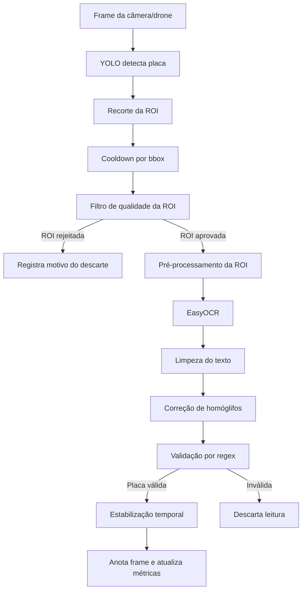

# Processamento de Imagem e OCR de Placas

## 1. Introdução

&emsp;Nessa sprint, o foco do estudo de visão computacional foi direcionado para um ponto mais
específico do problema do projeto: a leitura dos caracteres da placa depois que
ela já foi localizada no frame. A detecção com YOLO já vinha apresentando um
comportamento relativamente estável para localizar a região da placa, mas isso
não significava que o texto dentro dessa região seria lido corretamente.

&emsp;Em termos práticos, o YOLO responde à pergunta “onde está a placa?”, enquanto o
EasyOCR responde à pergunta “quais são os caracteres dessa placa?”. Essas duas
etapas são complementares, mas têm gargalos diferentes. Uma placa pode ser bem
detectada e, ainda assim, gerar uma leitura ruim se a ROI estiver pequena,
borrada, escura, comprimida ou inclinada.

&emsp;Por isso, o papel do processamento de imagem nesta sprint não foi adicionar o
maior número possível de filtros, mas organizar um fluxo controlado entre a
detecção e o OCR. A solução precisava equilibrar dois objetivos que entram em
tensão o tempo todo no cenário de câmera/drone:

- melhorar a chance de leitura dos caracteres;
- evitar atraso excessivo no vídeo em tempo real.

## 2. Problema identificado

&emsp;O problema central observado foi simples de formular, mas difícil de resolver:

```text
a placa era detectada, mas os caracteres nem sempre eram lidos corretamente.
```

&emsp;Essa falha não estava concentrada apenas em um ponto único. A leitura pelo OCR
podia piorar por vários fatores do cenário real:

- ROI pequena demais;
- imagem borrada por movimento;
- baixa nitidez;
- compressão do vídeo;
- variações de iluminação;
- inclinação da placa;
- confusão entre caracteres parecidos, como `O/0`, `I/1`, `S/5` e `B/8`.

&emsp;Esses problemas mostram por que melhorar apenas o detector não resolveria o
gargalo sozinho. A detecção e o OCR são etapas diferentes da pipeline. O YOLO
define a bbox da placa, mas blur, resolução insuficiente e contraste ruim
dificultam diretamente o trabalho do EasyOCR.

## 3. Primeiro processamento

&emsp;Antes da reorganização da Sprint 4, o projeto já havia explorado uma linha mais
genérica e experimental de processamento digital de imagens. Essa base aparece,
principalmente, em dois lugares do repositório:

- na análise técnica da pipeline da Sprint 2, em [analise-tecnica-pipeline-placas.mdx](/home/lorena/g03/docs/docs/sprint-2/Visão%20Computacional/analise-tecnica-pipeline-placas.mdx);
- no estudo prático de processamento clássico em [processar_imagem.py](/home/lorena/g03/src/processar_imagem.py).

&emsp;Esse caminho tinha valor como estudo de visão computacional clássica, porque
testava operações como:

- grayscale;
- filtro gaussiano;
- Sobel;
- limiarização;
- extração de pontos.

&emsp;O problema não era a utilidade conceitual dessas técnicas. O problema era que
essa linha anterior ainda não estava bem integrada ao fluxo real de leitura de
placas em câmera/drone. Muitas operações faziam sentido do ponto de vista de
processamento visual, mas não estavam diretamente conectadas ao objetivo final
da aplicação, que é produzir um texto de placa utilizável em tempo real.

&emsp;Na Sprint 4, o processamento foi reorientado para o problema real do projeto:

```text
melhorar a imagem da ROI da placa para aumentar a chance de leitura pelo EasyOCR,
sem causar atraso excessivo no vídeo da câmera/drone.
```

Isso significa que a mudança principal não foi “aplicar mais filtros”, mas sim
criar um fluxo medido, controlado e integrado ao OCR.

| Aspecto | Processamento anterior | Processamento atual |
|---|---|---|
| Objetivo | Explorar filtros e contornos | Melhorar OCR da ROI da placa |
| Integração | Mais isolada/experimental | Integrada ao pipeline YOLO + EasyOCR |
| Saída | Imagem/contornos/pontos | Texto validado da placa |
| Métrica principal | Resultado visual | OCR válido, FPS e tempo de execução |
| Risco | Processamento sem impacto direto no OCR | Balanceamento entre recall e performance |

## 4. Nova arquitetura do OCR

Depois da limpeza da camada antiga, a implementação principal passou a ficar
concentrada em poucos módulos:

```text
src/visao_computacional/ocr/
├── config.py
├── quality.py
├── pipeline.py
├── plate_text.py
└── metrics.py
```

Essa estrutura foi pensada para que cada arquivo responda a uma pergunta
específica da pipeline:

| Arquivo | Responsabilidade |
|---|---|
| `config.py` | Centraliza perfis, thresholds e flags do OCR |
| `quality.py` | Decide se a ROI tem qualidade mínima para ir ao OCR |
| `pipeline.py` | Gera candidatos de imagem, executa EasyOCR e seleciona o melhor resultado |
| `plate_text.py` | Limpa texto, corrige homóglifos e valida formatos de placa |
| `metrics.py` | Agrega métricas de runtime e benchmark |

O arquivo [plate_recognizer.py](/home/lorena/g03/src/visao_computacional/yolo26/plate_recognizer.py)
continua sendo o orquestrador do frame. O papel dele é coordenar o pipeline no
nível mais alto:

```text
YOLO → crop da placa → OCR pipeline → estabilização → desenho no frame
```

Em versões anteriores, o OCR ficava mais espalhado em arquivos auxiliares e em
camadas intermediárias de compatibilidade. Na arquitetura efetiva da Sprint 4,
o fluxo principal ficou concentrado nos módulos acima.

## 5. Fluxo atual do processamento

O fluxo operacional atual pode ser representado assim:



Em texto, o funcionamento é o seguinte:

1. Um frame BGR chega do OpenCV.
2. O YOLO localiza possíveis placas.
3. Cada bbox gera uma ROI recortada.
4. O cooldown verifica se vale a pena processar a mesma região de novo.
5. O quality gate analisa se a ROI merece OCR.
6. Se a ROI passar, a pipeline prepara uma versão leve da imagem.
7. O EasyOCR tenta ler os caracteres.
8. O texto bruto é limpo e corrigido.
9. A leitura é validada contra formatos aceitos de placa.
10. Leituras válidas passam por estabilização temporal.
11. O frame é anotado e as métricas agregadas são atualizadas.

## 6. Configuração do OCR

O papel de `OCRConfig`, definido em [config.py](/home/lorena/g03/src/visao_computacional/ocr/config.py),
é centralizar a política operacional do OCR. Em vez de espalhar decisões por
vários pontos do código, a Sprint 4 concentrou os parâmetros que definem como o
OCR deve se comportar em tempo real.

Os campos mais importantes são:

- `runtime_profile`
- `mode`
- `max_candidates_runtime`
- `primary_preprocess`
- `secondary_preprocess`
- `enable_secondary_candidate`
- `quality_filter_enabled`
- `cooldown_enabled`
- `min_roi_width`
- `min_roi_height`
- `min_blur_variance`
- `min_aspect_ratio`
- `max_aspect_ratio`

O perfil padrão adotado para câmera foi `fast`, porque ele prioriza fluidez:

```text
1 candidato
fallback desligado
debug desligado
filtro de qualidade ligado
cooldown ligado
```

Essa escolha foi importante porque a Sprint 4 não tinha como objetivo principal
maximizar o recall do OCR a qualquer custo. O objetivo era manter o runtime
estável em vídeo ao vivo.

## 7. Filtro de qualidade da ROI

O arquivo [quality.py](/home/lorena/g03/src/visao_computacional/ocr/quality.py)
implementa o filtro de qualidade da ROI. A lógica dele é decidir se a região da
placa merece ou não uma chamada ao EasyOCR.

Os motivos de descarte atuais são:

- `invalid_crop`
- `empty_crop`
- `low_width`
- `low_height`
- `aspect_too_small`
- `aspect_too_large`
- `low_blur_variance`

O caso `low_blur_variance` usa a variância do Laplaciano como proxy de nitidez.
Não é uma medida perfeita de legibilidade, mas é uma heurística barata para
estimar se a ROI tem detalhes suficientes para leitura.

O ponto central desse filtro é:

```text
O filtro de qualidade protege a performance, evitando gastar EasyOCR em ROIs com baixa chance de leitura.
```

Ao mesmo tempo, existe uma limitação importante:

```text
Se o filtro for agressivo demais, ele pode descartar placas que ainda seriam recuperáveis.
```

Esse trade-off aparece claramente nos resultados observados mais adiante.

## 8. Pré-processamento da ROI

O tratamento da ROI foi concentrado em [pipeline.py](/home/lorena/g03/src/visao_computacional/ocr/pipeline.py).

Os candidatos de imagem documentados na arquitetura são:

- `resized_color`
- `gray_resized`
- `gray_blur_light`
- `sharpen_light`
- `threshold_experimental`

No entanto, a Sprint 4 diferencia duas ideias:

- `modo benchmark`: testa múltiplas versões;
- `modo runtime`: usa poucas versões para preservar FPS.

No perfil `fast`, o sistema opera essencialmente com um único candidato por ROI,
normalmente `gray_resized`, porque essa versão tende a equilibrar simplicidade,
baixo custo e redução de variação cromática antes do OCR.

Isso mostra que o pré-processamento atual não tenta “embelezar” agressivamente
a imagem. Ele tenta apenas entregar ao EasyOCR uma ROI mais estável do ponto de
vista visual.

## 9. EasyOCR e seleção do melhor resultado

Em [pipeline.py](/home/lorena/g03/src/visao_computacional/ocr/pipeline.py),
`run_ocr_on_candidates(...)` é a função que executa o EasyOCR e coleta, para
cada hipótese:

- texto bruto;
- texto limpo;
- confiança;
- preprocessamento usado;
- tempo de OCR;
- tempo de pré-processamento.

Depois disso, `select_best_ocr_candidate(...)` escolhe a melhor hipótese com
base em:

1. regex válida;
2. maior confiança;
3. preprocessamento menos agressivo;
4. menor tempo em caso de empate.

Isso é importante porque a pipeline não aceita um texto apenas por confiança
alta. Se a saída não respeitar um formato de placa aceito, ela continua sendo
tratada como inválida.

## 10. Validação textual da placa

O arquivo [plate_text.py](/home/lorena/g03/src/visao_computacional/ocr/plate_text.py)
é responsável por transformar a saída textual do OCR em uma leitura
semanticamente utilizável.

Os formatos aceitos são:

- `BR_OLD`: `LLLNNNN`
- `BR_MERCOSUL`: `LLLNLNN`
- `UK_TEST`: formato de teste/compatibilidade

A correção de homóglifos considera ambiguidades como:

```text
0 ↔ O
1 ↔ I
2 ↔ Z
5 ↔ S
8 ↔ B
```

O ponto importante é que a correção não é aleatória. Ela respeita a posição
esperada de letras e números em cada formato. Isso evita transformar qualquer
texto do OCR em uma “placa válida” apenas por substituição ingênua de
caracteres.

## 11. Cooldown e estabilização temporal

Dois mecanismos diferentes foram mantidos para controlar custo e estabilidade.

### Cooldown

O cooldown atua antes do OCR. Seu objetivo é:

```text
reduzir custo e evitar chamadas redundantes ao EasyOCR.
```

Se a mesma bbox já foi processada recentemente, a pipeline pode reutilizar a
informação recente em vez de acionar OCR de novo no frame seguinte.

### Estabilização temporal

A estabilização temporal atua depois do OCR. Seu objetivo é:

```text
reduzir flicker e variação entre leituras sucessivas.
```

Ela guarda leituras recentes e tenta consolidar uma placa mais estável ao longo
de alguns frames.

| Mecanismo | Atua antes ou depois do OCR? | Objetivo |
|---|---|---|
| Cooldown | Antes do OCR | Evitar processamento repetido |
| Estabilização temporal | Depois do OCR | Confirmar leituras consistentes |

## 12. Métricas de runtime

O arquivo [metrics.py](/home/lorena/g03/src/visao_computacional/ocr/metrics.py)
foi mantido como o ponto de medição do comportamento do pipeline em câmera.

As métricas observadas incluem:

- `frames_processed`
- `plates_detected`
- `ocr_attempts`
- skips por motivo
- `valid_plates`
- `avg_preprocess_time_ms`
- `avg_easyocr_time_ms`
- `avg_total_ocr_time_ms`
- `p95_total_ocr_time_ms`
- `estimated_fps`
- `runtime_candidates_avg`
- `fallbacks_used`
- médias de largura, altura, aspect ratio e blur

Essas métricas são importantes porque permitem separar gargalos:

```text
Elas permitem saber se o sistema está lento por causa do OCR, do YOLO ou de filtros agressivos antes do OCR.
```

Em termos de implementação:

- `update_detection()` registra cada bbox aceita pelo YOLO;
- `update_skipped(...)` registra descarte por cooldown ou quality gate;
- `update_attempt(...)` registra custo e resultado do OCR;
- `summary()` consolida médias e contagens;
- `log_if_needed(...)` imprime o bloco agregado periodicamente.

## 13. Resultados observados nos testes

Os testes da Sprint 4 mostraram dois momentos diferentes da pipeline.

### Cenário anterior à otimização

```text
frames_processed=7380
plates_detected=768
ocr_attempts=1536
valid_plates=149
avg_ocr_time_ms=173.6
p95_ocr_time_ms=469.3
estimated_fps=12.1
runtime_candidates_avg=2.00
fallbacks_used=660
```

### Cenário posterior à otimização

```text
frames_processed=5460
plates_detected=1698
ocr_attempts=225
ocr_skipped_low_quality=1300
ocr_skipped_cooldown=173
valid_plates=164
avg_total_ocr_time_ms=137.9
p95_total_ocr_time_ms=242.9
estimated_fps=14.9
runtime_candidates_avg=1.02
fallbacks_used=0
```

| Métrica | Antes | Depois | Interpretação |
|---|---:|---:|---|
| FPS estimado | 12.1 | 14.9 | Aproximou o sistema do tempo real |
| Candidatos médios | 2.00 | 1.02 | Reduziu chamadas ao EasyOCR |
| Fallbacks | 660 | 0 | Removeu gargalo de fallback |
| OCR p95 | 469.3ms | 242.9ms | Reduziu picos de latência |
| OCR attempts | 1536 | 225 | O filtro passou a proteger o runtime |
| Placas válidas | 149 | 164 | Manteve/levemente aumentou leituras válidas |

Os próprios números deixam uma ressalva importante:

```text
O sistema ficou mais eficiente em performance, mas o filtro de qualidade ficou bastante seletivo.
```

Alguns cálculos ajudam a visualizar isso:

- OCR executado em 13,3% das detecções: `225 / 1698`
- Placas válidas por tentativa de OCR: `72,9% = 164 / 225`
- Placas válidas por detecção YOLO: `9,7% = 164 / 1698`
- Descartes por `low_quality`: `76,6% = 1300 / 1698`

Ou seja, o OCR passou a ser muito mais seletivo e eficiente quando é acionado,
mas isso aconteceu ao custo de uma barreira mais forte na entrada.

## 14. Erros observados do OCR

&emsp;Além das métricas agregadas, os testes mostraram erros recorrentes no padrão
de leitura do OCR. Como ainda não existe ground truth completo para câmera ao
vivo, os exemplos abaixo devem ser lidos como comportamento observado do OCR em
runtime, e não como tabela oficial de acurácia supervisionada.

| Situação | Saída do OCR | Saída corrigida | Resultado final | Observação |
|---|---|---|---|---|
| Confusão de alfanuméricos | `BRAO512` | `BRA0512` | válido | confusão entre `O` e `0` |
| Confusão de letras e dígitos | `DBDO512` | `DBD0512` | válido | correção pelo padrão brasileiro antigo |
| Leitura instável | `ECR0E22` | `ECR0E22` | inválido/duvidoso | possível confusão em caracteres finais |
| ROI rejeitada | sem leitura | sem leitura | descartada | barrada antes do OCR por baixa qualidade |

&emsp;Também houve descarte explícito de ROIs antes do OCR, com motivos como:

| Motivo do descarte | Significado |
|---|---|
| `low_blur_variance` | ROI considerada pouco nítida |
| `low_width` | ROI muito estreita |
| `low_height` | ROI muito baixa |
| `aspect_too_small` | proporção inadequada |
| `aspect_too_large` | proporção inadequada |

## 15. Comparação entre pipeline anterior e pipeline atual

| Métrica | Pipeline anterior | Pipeline atual | Interpretação |
|---|---:|---:|---|
| FPS estimado | 12.1 | 14.9 | O runtime ficou mais próximo do tempo real |
| Tempo médio de OCR | 173.6 ms | 137.9 ms | O custo médio da leitura diminuiu |
| p95 do OCR | 469.3 ms | 242.9 ms | Os picos de latência ficaram menores |
| Candidatos médios por ROI | 2.00 | 1.02 | O OCR passou a operar de forma mais enxuta |
| Fallbacks | 660 | 0 | O fallback deixou de ser gargalo |
| OCR attempts | 1536 | 225 | O quality gate passou a proteger o runtime |
| Placas válidas | 149 | 164 | Houve leve ganho absoluto de leituras válidas |
| Taxa de leitura válida por OCR attempt | 9.7% | 72.9% | O OCR ficou muito mais eficiente quando acionado |
| Taxa de leitura válida por detecção YOLO | 19.4% | 9.7% | O pipeline atual é mais seletivo antes do OCR |

&emsp;Essa comparação deixa claro que o problema principal mudou. No cenário
anterior, o OCR era acionado em excesso e o fallback gerava custo alto. No
cenário atual, o runtime está mais estável e o OCR ficou mais eficiente quando
executado, mas a cobertura operacional caiu porque o filtro de qualidade passou
a barrar grande parte das ROIs.

### Frame real com bbox


&emsp;A imagem acima mostra o frame bruto da câmera já com a bbox desenhada sobre a
placa. Esse é o ponto exato da pipeline em que o YOLO entrega a região de
interesse para o OCR.

### ROI original e ROI tratada

| ROI original capturada da câmera | ROI após o tratamento usado no OCR |
|---|---|
|  |  |

### Comparação lado a lado


&emsp;A ROI escolhida é representativa porque mostra exatamente o tipo de recorte que
chega ao OCR no uso real. No lado original, a placa aparece como foi entregue
pelo frame da câmera. No lado processado, a mesma ROI já passou pelo tratamento
leve usado no runtime, principalmente grayscale e redimensionamento, que são as
duas etapas priorizadas no perfil `fast`.

&emsp;A mudança visual mais importante não é “embelezar” a imagem, mas reduzir ruído
cromático e aumentar a área útil dos caracteres antes da leitura. Isso torna a
entrada mais adequada ao EasyOCR sem introduzir um custo pesado de processamento
por frame.

## 17. Discussão técnica

&emsp;A principal conclusão da Sprint 4 pode ser resumida assim:

```text
A otimização melhorou performance e reduziu custo, mas ainda existe um trade-off entre velocidade e cobertura.
```

Em termos práticos:

- o OCR não é mais acionado em excesso;
- o fallback deixou de ser gargalo;
- o runtime ficou mais estável;
- o filtro de qualidade protege FPS;
- porém, o filtro pode estar descartando ROIs úteis;
- o próximo desafio é calibrar thresholds sem perder performance.

&emsp;Esse resultado é coerente com a prioridade atual do projeto. Como o foco do
momento é câmera real, a sprint favoreceu estabilidade operacional antes de
partir para estratégias mais custosas de recall.

## 18. Limitações

&emsp;Apesar do ganho estrutural e operacional, a pipeline ainda tem limitações
claras:

- ainda não há ground truth em teste de câmera ao vivo;
- regex válida não garante acurácia real;
- o filtro `low_quality` precisa ser calibrado com mais cuidado;
- o YOLO ainda aparenta ser custo relevante por frame;
- a correção de perspectiva ainda é placeholder;
- técnicas experimentais, como Otsu e sharpen, não estão ativadas no runtime.

## 19. Próximos passos

&emsp;Os próximos passos mais realistas para continuidade são:

1. continuar testando com câmera real;
2. instrumentar melhor os motivos de descarte;
3. ajustar `min_blur_variance`, `min_roi_width` e `min_roi_height`;
4. comparar perfis `strict`, `balanced` e `recall`;
5. coletar algumas ROIs reais da câmera para análise manual;
6. só depois avaliar otimizações no YOLO ou frame skip;
7. manter o perfil `fast` como padrão para runtime.

## Conclusão

&emsp;A principal entrega da Sprint 4 não foi apenas “adicionar processamento de
imagem”, mas reorganizar o trecho mais sensível da pipeline entre o detector e o
OCR. Antes da otimização, o sistema acionava o EasyOCR com muita frequência,
testava mais de um candidato por ROI em média e ainda dependia fortemente de
fallback, o que elevava o custo do runtime e piorava os picos de latência.

&emsp;Depois da reorganização, o comportamento operacional ficou mais controlado: o
OCR passou a rodar com aproximadamente um candidato por ROI, o fallback deixou
de ser gargalo, o tempo total médio caiu e o FPS estimado subiu de `12.1` para
`14.9`. Ao mesmo tempo, os números também mostraram o novo limite da pipeline:
o quality gate protegeu o runtime, mas se tornou bastante seletivo, barrando uma
parte grande das ROIs antes mesmo da leitura.

&emsp;Em outras palavras, a Sprint 4 não resolveu de forma definitiva o problema da
leitura de placas, mas mudou a natureza do gargalo. O problema deixou de ser um
OCR excessivamente caro e instável e passou a ser a calibração do ponto de
equilíbrio entre desempenho e cobertura. Com isso, a base atual já permite
entender com mais precisão:

- por que o processamento de imagem foi alterado;
- como o OCR funciona agora;
- quais arquivos respondem por cada etapa;
- quais métricas foram observadas;
- o que melhorou;
- e quais pontos ainda precisam de ajuste.
