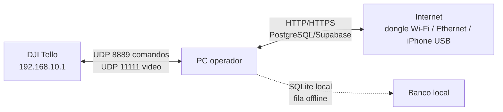

# Relatorio tecnico: separacao entre Tello local e APIs com Internet

## 1. Resumo executivo

&emsp;Esta entrega adequa o codigo para operar com dois planos de rede ao mesmo tempo:

- **Plano Tello/local/offline:** comandos UDP e video do DJI Tello, sem depender de Internet.
- **Plano API/Internet:** chamadas HTTP da TUI e sincronizacao PostgreSQL/Supabase, que precisam sair pela rota com Internet, como dongle Wi-Fi USB, Ethernet/cabo ou iPhone USB.

&emsp;A decisao tecnica foi centralizar os parametros de rede em `src/network_routes.py`, remover IPs e URLs do Tello fixos dos scripts principais e permitir que as chamadas HTTP usem um IP de origem especifico quando a operacao quiser forcar saida pela interface de Internet.

## 2. Hipotese e decisao

| Item | Registro |
| --- | --- |
| Hipotese | O PC pode ficar no Wi-Fi do Tello para UDP e usar outra interface para APIs, desde que o codigo nao misture os dois planos. |
| Contra-tese | Se o codigo depender da rota default para tudo, uma troca de Wi-Fi para `Tello-XXXXXX` pode derrubar chamadas de API ou enviar trafego pelo adaptador errado. |
| Decisao | Separar configuracao Tello e API via variaveis de ambiente, script de preflight e mensagens operacionais no runtime. |
| Criterio de aceite | Comandos do Tello usam `TELLO_*`; chamadas HTTP usam `PIER_API_URL` e podem usar `PIER_API_SOURCE_IP`; diagnostico valida Tello e Internet separadamente. |
| Metrica observavel | `compileall` sem erro, Docusaurus build sem erro novo, `check_tello_dual_network.ps1 -TestInternet` comprovando egress de Internet. |

### 2.1 Escolhas tecnicas e riscos evitados

| Escolha documentada | Risco se ignorada | Decisao aplicada | Criterio de aceite |
| --- | --- | --- | --- |
| Remover IPs e portas hardcoded do Tello. | IP/porta fixos prendem o codigo a uma topologia unica; se a porta local estiver ocupada, se o Windows escolher outra interface ou se a operacao precisar mudar valores por `.env`, a falha fica dificil de diagnosticar. | Carregar `TELLO_HOST`, `TELLO_COMMAND_PORT`, `TELLO_LOCAL_PORT`, `TELLO_STATE_PORT`, `TELLO_VIDEO_HOST`, `TELLO_VIDEO_PORT` e `TELLO_VIDEO_URL` via `load_tello_config()`. | CLI, demo e WebRTC leem configuracao por ambiente, sem alterar codigo-fonte. |
| Usar `src/network_routes.py` como fonte comum de rede. | Sem helper central, CLI, WebRTC e chamadas de API duplicam regras e podem divergir sobre o que vai para o Tello e o que vai para Internet. | Concentrar bind UDP, URL de video, portas do Tello, plano de rede e sessao HTTP com IP de origem opcional em `network_routes.py`. | O runtime imprime o plano ativo e todos os caminhos Tello/API usam a mesma configuracao. |
| Manter `udp://@0.0.0.0:11111` como URL padrao de video. | Outro formato pode ate abrir o `VideoCapture`, mas nao receber frames; o Tello envia video UDP para a porta local `11111` e o FFmpeg precisa atuar como listener. | Deixar `TELLO_VIDEO_URL` vazio por padrao para montar `udp://@0.0.0.0:11111`; permitir override apenas quando houver novo teste. | OpenCV/FFmpeg abre a URL validada e recebe frames ao vivo do Tello. |
| Executar preflight de portas antes da CLI/WebRTC. | Se outro processo Python, app do Tello ou tentativa anterior segurar `9000`, `11111`, `8890`, `8899` ou `8765`, o servidor pode subir aparentemente bem e nao receber video/estado. | Runners verificam portas ocupadas e exibem PID/comando antes de iniciar a operacao. | Portas criticas estao livres antes de `streamon`, CLI ou WebRTC. |
| Bloquear operacao quando a rede do Tello estiver como `Public`. | No Windows, perfil publico tende a bloquear trafego de entrada; como o video do Tello e UDP inbound, o streaming pode morrer mesmo com `streamon` respondendo `ok`. | Preflight orienta mudar o SSID do Tello para `Private` antes de abrir CLI/WebRTC. | Rede `TELLO-...` esta como `Private` durante teste de video. |
| Aplicar regra de firewall para UDP do Tello. | Mesmo com codigo correto, o Windows pode bloquear entrada UDP `11111`, `8890` e `8899`, reproduzindo o sintoma de comando funcionando e video ausente. | Criar regra `G03 Tello UDP Inbound` via `scripts/enable_tello_video_firewall_rule.ps1`. | Firewall permite entrada UDP a partir de `192.168.10.1` nas portas de video/estado. |
| Documentar Wifi Dual Connection, incluindo iPhone USB. | A solucao real nao e apenas conectar no Tello; e manter Wi-Fi no Tello e Internet por segunda interface. Sem documentar os metodos, a operacao nao e reproduzivel por outra pessoa. | Registrar dongle Wi-Fi USB, Ethernet/cabo e iPhone USB como caminhos de segunda interface; manter procedimento especifico do iPhone USB e drivers Apple. | Preflight mostra Wi-Fi do Tello em `192.168.10.x` e rota default por uma interface com Internet. |
| Exigir prova UDP/OpenCV antes de culpar WebRTC/frontend. | WebRTC pode negociar corretamente, mas se o PC nao recebe pacotes UDP ou o OpenCV nao decodifica frames, o frontend nunca tera video real. | Usar `probe_tello_video_udp.py` e leitura OpenCV com `udp://@0.0.0.0:11111` como cama minima antes do WebRTC. | Probe recebe pacotes em `11111` e OpenCV le frames `960x720` ao vivo antes do teste de browser. |

## 3. Arquitetura de rede



&emsp;O fluxo durante voo deve priorizar persistencia local: o Tello entrega video por UDP, o reconhecimento salva evidencias localmente e a sincronizacao remota pode acontecer quando houver Internet estavel. APIs e banco remoto nunca devem ser requisito para manter o controle local do drone.

## 4. Mudancas implementadas

| Arquivo | Mudanca |
| --- | --- |
| `src/network_routes.py` | Novo helper para carregar variaveis `TELLO_*`, montar `udp://...`, fazer bind do socket UDP e criar uma sessao HTTP com IP de origem opcional. No Windows, o bind do socket do Tello usa `SO_EXCLUSIVEADDRUSE` para evitar duas CLIs presas na mesma porta. |
| `src/visao_computacional/drone.py` | Substitui `192.168.10.1:8889`, `9000` e `udp://0.0.0.0:11111` fixos por `load_tello_config()`. Ao iniciar, imprime o plano Tello/API ativo e aplica opcoes FFmpeg para UDP. |
| `src/index.py` | Atualiza o demo simples do Tello para usar a mesma configuracao centralizada. |
| `src/tui.py` | Troca `requests.request(...)` direto por `API_SESSION.request(...)`, permitindo `PIER_API_SOURCE_IP` ou `API_SOURCE_IP`. |
| `src/supabase_matcher.py` | Adiciona `DATABASE_CONNECT_TIMEOUT` e mensagem de erro orientada para falta de rota de Internet quando a conexao PostgreSQL/Supabase falha. |
| `src/visao_computacional/yolo11/plate_recognizer.py` | Usa `TELLO_VIDEO_URL` ou `TELLO_VIDEO_HOST`/`TELLO_VIDEO_PORT` no modo de teste direto. |
| `src/visao_computacional/yolo26/plate_recognizer.py` | Usa `TELLO_VIDEO_URL` ou `TELLO_VIDEO_HOST`/`TELLO_VIDEO_PORT` no modo de teste direto. |
| `src/visao_computacional/yolov8n/plate_recognizer.py` | Usa `TELLO_VIDEO_URL` ou `TELLO_VIDEO_HOST`/`TELLO_VIDEO_PORT` no modo de teste direto. |
| `.env.example` | Documenta variaveis de rede para Tello, TUI/API e Supabase. |
| `scripts/check_tello_dual_network.ps1` | Ganha `-TestInternet`, `-InternetSourceIp` e `-InternetUrl` para validar a saida das APIs separada do probe UDP do Tello. |
| `requirements.txt` | Inclui dependencias de visao usadas em runtime: `ultralytics` e `easyocr`. |
| `scripts/setup_tello_cli_env.ps1` | Cria/atualiza `.venv`, instala dependencias e reinstala `opencv-python` GUI apos o `easyocr` para preservar `cv2.imshow`. |
| `scripts/check_tello_cli_env.py` | Valida imports da CLI, versao do OpenCV e suporte de GUI antes de abrir o drone. |
| `scripts/probe_tello_video_udp.py` | Envia `command`/`streamon` e escuta UDP `11111` sem OpenCV para isolar falha de video. O probe agora usa bind exclusivo por padrao e escuta tambem `8890` e `8899` para separar video, telemetria e respostas auxiliares. |
| `scripts/run_tello_cli.ps1` | Antes de abrir a CLI, verifica se `9000`, `11111`, `8890` ou `8899` ja estao ocupadas e mostra PID/comando do processo conflitante. Tambem bloqueia a execucao se o SSID do Tello estiver como `Public`, orientando a troca para `Private`. |
| `scripts/enable_tello_video_firewall_rule.ps1` | Cria regra administrativa de firewall para liberar entrada UDP `11111`, `8890` e `8899` a partir de `192.168.10.1` em todos os perfis. |

## 5. Variaveis de ambiente

### 5.1 Tello local/offline

```env
TELLO_HOST=192.168.10.1
TELLO_COMMAND_PORT=8889
TELLO_LOCAL_PORT=9000
TELLO_LOCAL_IP=
TELLO_VIDEO_HOST=0.0.0.0
TELLO_VIDEO_PORT=11111
TELLO_VIDEO_URL=
```

&emsp;`TELLO_LOCAL_IP` deve ficar vazio na maior parte dos testes. Use apenas quando quiser fixar o bind no IP local da interface Wi-Fi conectada ao `Tello-XXXXXX`, por exemplo `192.168.10.2`.

&emsp;Quando `TELLO_VIDEO_URL` fica vazio, o codigo monta a URL no formato listener do FFmpeg: `udp://@0.0.0.0:11111`.

### 5.2 APIs e banco remoto

```env
PIER_API_URL=http://localhost:5000
PIER_API_SOURCE_IP=
API_SOURCE_IP=
DATABASE_CONNECT_TIMEOUT=10
DATABASE_URL=postgresql://...
```

&emsp;`PIER_API_SOURCE_IP` e `API_SOURCE_IP` sao opcionais. Quando preenchidos, a TUI tenta iniciar as chamadas HTTP a partir desse IP local. Use apenas quando quiser forcar a saida por uma interface especifica de Internet, como dongle Wi-Fi, Ethernet/cabo ou iPhone USB. No cenario validado com iPhone USB, o valor observado foi `172.20.10.4`, mas esse IP pode mudar a cada conexao.

&emsp;A conexao PostgreSQL/Supabase continua usando a rota default do Windows. Por isso, o preflight precisa garantir que a melhor rota default nao esteja saindo pelo Wi-Fi do Tello.

## 6. Como rodar o preflight

### 6.1 Internet por segunda interface

```powershell
powershell -ExecutionPolicy Bypass -File .\scripts\check_tello_dual_network.ps1 `
  -TestInternet `
  -RequireInternet
```

&emsp;Resultado esperado: o script lista as rotas, informa que a melhor rota default nao esta na rede `192.168.10.x` do Tello e recebe resposta de `https://api.ipify.org`. Se for necessario provar uma interface especifica, informe o IP local com `-InternetSourceIp`, por exemplo o IP do dongle, da Ethernet/cabo ou do iPhone USB.

### 6.2 Probe UDP do Tello

```powershell
powershell -ExecutionPolicy Bypass -File .\scripts\check_tello_dual_network.ps1 `
  -ProbeDrone
```

&emsp;Resultado esperado com o drone ligado e PC no SSID `Tello-XXXXXX`: o script envia `command` e `battery?` por UDP. Esse probe nao decola nem move o drone.

### 6.3 Probe do video UDP

Depois de confirmar comando/bateria, valide se o stream chega antes de culpar o OpenCV:

```powershell
.\.venv\Scripts\python.exe .\scripts\probe_tello_video_udp.py --seconds 15
```

Resultado esperado: ao menos um `video:11111 packet ... from ('192.168.10.1', ...)`. Se o resumo `UDP_SUMMARY video:11111` terminar com `packets=0`, o Windows nao entregou nenhum pacote de video UDP `11111` ao processo.

Se a rede do Tello estiver como `Public`, libere a porta de video em PowerShell como Administrador:

```powershell
powershell -ExecutionPolicy Bypass -File .\scripts\enable_tello_video_firewall_rule.ps1
Set-NetConnectionProfile -InterfaceAlias 'Wi-Fi' -NetworkCategory Private
```

### 6.4 Operacao com codigo do drone

Prepare a `.venv` local antes do primeiro uso ou apos limpar dependencias:

```powershell
powershell -ExecutionPolicy Bypass -File .\scripts\setup_tello_cli_env.ps1
```

Esse script tambem corrige uma armadilha do ambiente: `easyocr` instala `opencv-python-headless`, mas a CLI do drone usa `cv2.imshow`. Por isso, depois de instalar as dependencias, o script reinstala o `opencv-python` com suporte a janela e valida que o OpenCV esta com `GUI: WIN32UI`.

```powershell
.\.venv\Scripts\python.exe -m src.visao_computacional.drone
```

&emsp;Ao iniciar, o programa imprime o plano de rede ativo, por exemplo:

```text
Plano de rede ativo:
  - Tello/local UDP: 0.0.0.0:9000 -> 192.168.10.1:8889
  - Video Tello: udp://@0.0.0.0:11111
  - APIs/Internet: rota default do sistema operacional
```

## 7. Rastreabilidade de produto e requisitos

| Hipotese | Evidencia | Decisao | Requisito/story | Criterio de aceite |
| --- | --- | --- | --- | --- |
| O Tello precisa continuar local/offline. | SDK oficial usa UDP local para comando e video. | Manter `TELLO_*` separado de API. | Como operador, quero controlar o Tello mesmo sem Internet. | O socket do drone usa `TELLO_HOST`, `TELLO_COMMAND_PORT`, `TELLO_LOCAL_PORT` e `TELLO_LOCAL_IP`. |
| APIs precisam de Internet por outra interface. | Wifi Dual Connection foi validado por metodos diferentes: dongle Wi-Fi USB, cabo/Ethernet e iPhone USB. | TUI pode usar a rota default correta ou fixar IP de origem HTTP quando necessario. | Como sistema, quero consultar APIs pela interface com Internet. | `PIER_API_SOURCE_IP` ou `API_SOURCE_IP` altera a sessao HTTP da TUI quando preenchido. |
| Banco remoto nao pode travar sem feedback claro. | PostgreSQL/Supabase depende de rota externa. | Adicionar timeout e erro orientado a rota. | Como operador, quero diagnosticar falha de sincronizacao rapidamente. | Falha de conexao informa verificar Internet/rota default. |
| Preflight precisa ser repetivel. | Operacao depende de metricas e rotas do Windows. | Expandir script de diagnostico. | Como operador, quero validar Tello e Internet antes do voo. | Script testa interfaces Tello, rota default, Internet e opcionalmente UDP do Tello. |

## 8. Transparencia operacional

| Dimensao | Registro |
| --- | --- |
| Branch de trabalho | `docs-tello-conectividade` |
| Origem | Branch criada a partir de `origin/develop` em worktree separado para evitar misturar mudancas locais do checkout principal. |
| Escopo da alteracao | Codigo de rede Tello/API, script de diagnostico, variaveis de ambiente e documentacao Docusaurus. |
| Evidencia local coletada | `python -m compileall src` executou sem erro; `npm run build` no Docusaurus executou sem erro novo; o script de rede executou e listou as interfaces/rotas. |
| Evidencia de ambiente da CLI | `.venv` criada com Python 3.13; `setup_tello_cli_env.ps1` passou; OpenCV validado com `GUI: WIN32UI`; teste `process_frame` em frame vazio retornou sem erro. |
| Evidencia do teste com Tello | Em teste manual, `command` respondeu `ok`, `battery?` respondeu `73` e `streamon` respondeu `ok`, mas o OpenCV nao abriu o video apos timeout de 30s. |
| Evidencia de probe UDP video | Probe direto com socket em `0.0.0.0:11111` antes do `streamon` retornou `VIDEO_SUMMARY packets=0 bytes=0`, confirmando ausencia de pacotes de video no processo, nao apenas falha do OpenCV. |
| Evidencia de captura em baixo nivel | Em 01 jun. 2026, `pktmon` elevado capturou `2999` pacotes do Tello, incluindo `2839` pacotes `192.168.10.1:62512 -> 192.168.10.2:11111`, com `3799104` bytes de payload H.264 e zero drops reportados na captura. |
| Evidencia de decodificacao | O payload H.264 extraido do pcap abriu no OpenCV (`CAP_OPENED True`) e decodificou `30` frames, primeiro frame em `960x720`. Isso prova que o Tello emitiu video valido; a pendencia restante e receber ao vivo no socket/app. |
| Causa operacional encontrada | Uma instancia antiga de `python -m src.visao_computacional.drone` ficou em background segurando `0.0.0.0:9000`. O runner e o probe foram ajustados para detectar conflito de porta antes de iniciar novo teste. |
| Mitigacao aplicada | Regra `G03 Tello UDP Inbound` criada no Windows Firewall para entrada UDP `11111`, `8890` e `8899` com origem `192.168.10.1`; rede `TELLO-9C18BA` alterada de `Public` para `Private`; codigo ajustado para `udp://@0.0.0.0:11111`. |
| Evidencia de streaming ao vivo | Depois de limpar a CLI presa e colocar `TELLO-9C18BA` como `Private`, `probe_tello_video_udp.py --seconds 15` recebeu `1439` pacotes em `video:11111`, `155` pacotes em `state:8890` e `24` pacotes em `extra:8899`. Em seguida, OpenCV abriu `udp://@0.0.0.0:11111` (`CAP_OPENED True`) e leu `30` frames ao vivo em `960x720`. |
| Evidencia de campo reaproveitada | Dongle Wi-Fi USB funcionando como segundo Wi-Fi, cabo/Ethernet funcionando em reteste posterior e iPhone USB com `Apple Mobile Device Ethernet`, IP `172.20.10.4`, gateway `172.20.10.1` e Internet funcional sem `Inteli.College`. |
| Evidencia ao vivo desta entrega | Em 01 jun. 2026, o PC estava com `Ethernet 2`/iPhone USB `172.20.10.4` e Wi-Fi `10.150.3.141`. O teste por Wi-Fi respondeu `177.69.182.115`; o teste forcando `172.20.10.4` deu timeout antes de estabilizar, entao qualquer segunda interface escolhida precisa ser revalidada antes do voo. |
| Limite conhecido | O probe UDP do Tello exige o drone ligado e o PC conectado ao SSID `Tello-XXXXXX`; se o drone nao estiver presente, a validacao fica limitada a compilacao, build e teste de Internet. |
| Proxima decisao | Operar a CLI/WebRTC com o mesmo preflight: portas livres, rede `TELLO-9C18BA` como `Private`, Wifi Dual Connection por dongle/Ethernet/iPhone conforme disponibilidade, `streamon` e leitura OpenCV/WebRTC. |

## 9. Conclusao

&emsp;A resposta operacional passa a ser: **funciona quando o PC mantem duas rotas distintas e o codigo respeita essa separacao**. O Tello permanece em rede local UDP, e as APIs usam a interface com Internet. O codigo agora torna essa fronteira explicita, configuravel e verificavel antes da operacao.
