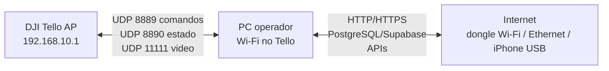

# Relatorio de Teste: Wifi Dual Connection

## 1. Resumo executivo

&emsp;Este relatorio registra a decisao operacional de conectividade para o DJI Tello na Sprint 4. A necessidade real nao e "usar iPhone USB"; a necessidade e manter o PC simultaneamente conectado ao **Wi-Fi local do Tello**, para comando/video UDP, e a uma **segunda interface com Internet**, para backend, banco PostgreSQL/Supabase, APIs e suporte remoto.

&emsp;A tese foi **confirmada por tres caminhos**:

| Metodo | Resultado | Leitura operacional |
| --- | --- | --- |
| Dongle Wi-Fi USB | Funcionou e foi a solucao mais simples observada, porque fornece um segundo Wi-Fi dedicado. | Caminho preferencial quando houver adaptador disponivel. |
| Cabo/Ethernet | Validado como caminho estavel para Internet por segunda interface. | Caminho robusto quando houver rede cabeada no local. |
| iPhone USB / Acesso Pessoal | Funcionou apos instalacao/ajuste de drivers Apple e validacao de egress pela interface `Apple Mobile Device Ethernet`. | Caminho valido de contingencia movel, mas exige preflight mais cuidadoso. |

&emsp;Decisao: documentar e operar como **Wifi Dual Connection**. O iPhone USB continua documentado porque foi validado com esforco real de ambiente, mas nao deve ser apresentado como unica nem melhor opcao. A arquitetura recomendada e: **Wi-Fi do Tello para UDP + qualquer segunda interface estavel para Internet**.

&emsp;A mudanca de codigo que separa o plano local do Tello das chamadas de API com Internet esta documentada em [Rotas Tello e APIs](./relatorio-rotas-tello-api.md).

## 2. Hipotese e criterio de aceite

&emsp;Hipotese testavel: um PC Windows consegue manter o Wi-Fi conectado ao `Tello-XXXXXX` para UDP e, ao mesmo tempo, manter Internet por uma segunda interface sem sequestrar a rota local do drone nem a rota default externa.

&emsp;Criterio de sucesso:

- O PC possui uma interface Wi-Fi com IP `192.168.10.x`, conectada ao Tello.
- O Tello responde a `command` e `battery?` por UDP.
- O video UDP chega em `0.0.0.0:11111` apos `streamon`.
- A rota default `0.0.0.0/0` fica em uma interface com Internet, nao no Wi-Fi do Tello.
- Backend, APIs e banco remoto conseguem sair pela interface de Internet.
- O metodo escolhido e registrado antes da operacao: dongle Wi-Fi, Ethernet/cabo, iPhone USB ou outro adaptador.

## 3. Desenho de arquitetura



&emsp;O ponto central e que existem dois planos de rede:

| Plano | Interface esperada | Trafego |
| --- | --- | --- |
| Tello local/offline | Wi-Fi conectado ao `Tello-XXXXXX` | UDP `8889`, `8890`, `11111` |
| Internet/APIs | Segunda interface | HTTP/HTTPS, PostgreSQL/Supabase, backend remoto |

&emsp;O Tello comum permanece em modo AP e nao precisa de Internet. A Internet deve ser resolvida pelo PC de campo, com dual connection.

## 4. Metodos avaliados

### 4.1 Dongle Wi-Fi USB

&emsp;O uso de dongle Wi-Fi USB foi validado como alternativa mais eficiente e simples, porque cria uma segunda interface Wi-Fi diretamente: uma interface pode ficar no Tello e a outra em uma rede com Internet.

| Campo | Registro |
| --- | --- |
| Papel | Segundo adaptador Wi-Fi para separar Tello e Internet. |
| Vantagem | Setup mais simples quando o Windows reconhece o dongle sem driver extra. |
| Limite | Depende de disponibilidade fisica do adaptador e qualidade do driver. |
| Decisao | Preferencial para operacao de campo quando houver dongle disponivel. |

&emsp;Padrao esperado:

```text
Wi-Fi interno ou dongle A -> TELLO-XXXXXX / 192.168.10.x
Wi-Fi interno ou dongle B -> rede com Internet
```

### 4.2 Internet por cabo/Ethernet

&emsp;Tambem foi testada Internet por cabo/Ethernet. Esse caminho funcionou bem e reduz a dependencia de hotspot movel.

| Campo | Registro |
| --- | --- |
| Papel | Interface cabeada para Internet enquanto o Wi-Fi fica dedicado ao Tello. |
| Vantagem | Rota estavel, baixa variabilidade e menos dependente de bateria/celular. |
| Limite | Depende de infraestrutura fisica de rede no local. |
| Decisao | Excelente caminho quando houver cabo/Ethernet disponivel. |

&emsp;Padrao esperado:

```text
Wi-Fi -> TELLO-XXXXXX / 192.168.10.x
Ethernet -> Internet / rota default
```

### 4.3 iPhone USB / Acesso Pessoal

&emsp;O iPhone USB e uma alternativa movel validada para fornecer Internet por segunda interface. O funcionamento depende da instalacao e confirmacao do suporte Apple para que o Windows crie a interface `Apple Mobile Device Ethernet`.

| Campo | Registro |
| --- | --- |
| Papel | Interface movel para Internet via Acesso Pessoal USB. |
| Vantagem | Independe de rede cabeada ou segundo Wi-Fi disponivel no campo. |
| Limite | Exige iPhone presente, cabo, Acesso Pessoal ativo, permissao "Confiar neste computador" e driver Apple correto. |
| Decisao | Valido como contingencia movel; exige preflight obrigatorio. |

&emsp;Evidencia observada no teste:

| Sinal | Resultado |
| --- | --- |
| Adaptador | `Ethernet 2 - Apple Mobile Device Ethernet` |
| IP local | `172.20.10.4` |
| Gateway | `172.20.10.1` |
| Internet sem `Inteli.College` | HTTP `200` via `curl`, local `172.20.10.4` |
| Componente instalado | `Apple Mobile Device Support 19.4.0.10` |

&emsp;Esse teste provou que o PC pode liberar o Wi-Fi para o Tello e manter Internet via USB. A instabilidade intermediaria observada no hotspot reforca que o iPhone USB deve passar por checklist antes de voo.

## 5. Procedimento operacional geral

1. Escolher a segunda interface de Internet: dongle Wi-Fi, Ethernet/cabo, iPhone USB ou equivalente.
2. Conectar o PC ao `TELLO-XXXXXX` pelo Wi-Fi que ficara dedicado ao drone.
3. Confirmar IP local `192.168.10.x` na interface do Tello.
4. Confirmar que a rota default principal usa a interface com Internet.
5. Rodar preflight de rotas e, quando o Tello estiver ligado, probe UDP.
6. Abrir CLI ou servidor WebRTC somente depois de portas/firewall/perfil de rede estarem corretos.

Comandos de diagnostico:

```powershell
Get-NetAdapter | Sort-Object Name |
  Format-Table Name, InterfaceDescription, Status, LinkSpeed, ifIndex -AutoSize

Get-NetIPConfiguration |
  Select-Object InterfaceAlias, InterfaceIndex, IPv4Address, IPv4DefaultGateway |
  Format-List

Get-NetRoute -DestinationPrefix "0.0.0.0/0" |
  Sort-Object RouteMetric, InterfaceMetric |
  Format-Table InterfaceAlias, InterfaceIndex, NextHop, RouteMetric, InterfaceMetric -AutoSize
```

Preflight do projeto:

```powershell
powershell -ExecutionPolicy Bypass -File .\scripts\check_tello_dual_network.ps1 -TestInternet -RequireInternet
powershell -ExecutionPolicy Bypass -File .\scripts\check_tello_dual_network.ps1 -ProbeDrone
```

Probe de video UDP:

```powershell
.\.venv\Scripts\python.exe .\scripts\probe_tello_video_udp.py --seconds 15
```

## 6. Procedimento especifico: iPhone USB

&emsp;Use apenas quando o iPhone USB for o metodo escolhido para Internet.

1. Instalar iTunes oficial:

```powershell
winget install --id Apple.iTunes --source winget --accept-source-agreements --accept-package-agreements --silent
```

2. Verificar `Apple Mobile Device Support`:

```powershell
Get-ItemProperty 'HKLM:\Software\Microsoft\Windows\CurrentVersion\Uninstall\*',
                 'HKLM:\Software\WOW6432Node\Microsoft\Windows\CurrentVersion\Uninstall\*' `
  -ErrorAction SilentlyContinue |
  Where-Object { $_.DisplayName -match 'Apple|iTunes|Mobile Device' } |
  Select-Object DisplayName, DisplayVersion, Publisher, InstallDate
```

3. Se o suporte Apple nao aparecer, extrair o instalador oficial do iTunes e instalar o MSI `AppleMobileDeviceSupport64.msi` como Administrador.

4. Ativar o iPhone:

- conectar por USB;
- desbloquear;
- aceitar "Confiar neste computador";
- ativar **Ajustes > Acesso Pessoal**;
- confirmar `Apple Mobile Device Ethernet` como `Up`.

5. Validar egress pela interface:

```powershell
curl.exe --ipv4 --interface <IP_DO_IPHONE> --connect-timeout 10 --max-time 20 -sS `
  -w "`nexit=%{exitcode} http=%{http_code} local=%{local_ip}`n" `
  https://api.ipify.org
```

## 7. Rastreabilidade

| Hipotese | Evidencia | Decisao | Criterio de aceite |
| --- | --- | --- | --- |
| O Tello exige Wi-Fi local para UDP. | SDK e testes de campo com `command`, `battery?`, `streamon` e video UDP. | Manter Wi-Fi dedicado ao `TELLO-XXXXXX`. | IP `192.168.10.x`, resposta UDP e pacotes `11111`. |
| Internet pode vir de segunda interface. | Dongle Wi-Fi, cabo/Ethernet e iPhone USB foram observados como caminhos viaveis. | Tratar como Wifi Dual Connection. | Rota default fora da interface `192.168.10.x`. |
| iPhone USB e valido, mas nao deve ser a unica narrativa. | Funcionou apos drivers Apple, mas exigiu mais setup e preflight. | Documentar como contingencia movel. | `Apple Mobile Device Ethernet` com HTTP `200` antes do voo. |
| Dongle Wi-Fi reduz atrito operacional. | Operacao com segundo Wi-Fi dedicado foi validada no projeto. | Recomendar quando houver adaptador disponivel. | Duas interfaces Wi-Fi simultaneas: uma para Tello e outra para Internet. |
| Cabo/Ethernet reduz dependencia de celular. | Reteste com rede via cabo funcionou bem. | Recomendar quando houver infraestrutura fisica. | Wi-Fi no Tello + Ethernet como rota default. |

## 8. Ameacas a validade

| Ameaca | Descricao | Mitigacao |
| --- | --- | --- |
| Hardware variavel | Dongles, cabos e iPhones dependem de drivers e estado fisico. | Registrar metodo usado e rodar preflight antes de cada operacao. |
| Rota default errada | Windows pode preferir a interface sem Internet. | Conferir `Get-NetRoute 0.0.0.0/0` e ajustar metricas quando necessario. |
| Rede Tello em perfil Public | Windows pode bloquear UDP inbound. | Manter SSID do Tello como `Private` e aplicar regra de firewall. |
| Porta ocupada | Tentativas anteriores podem segurar UDP/TCP. | Usar runners/preflight antes de abrir CLI ou WebRTC. |
| Evidencia incompleta por metodo | Nem todos os metodos tiveram a mesma profundidade de log. | Repetir checklist padrao em cada metodo durante testes de campo. |

## 9. Conclusao

&emsp;A decisao correta para o MVP e operar com **Wifi Dual Connection**: o Wi-Fi do PC fica dedicado ao Tello, e a Internet entra por uma segunda interface. O dongle Wi-Fi USB foi o caminho mais simples observado, o cabo/Ethernet tambem funcionou bem, e o iPhone USB permanece documentado como alternativa movel validada.

&emsp;Assim, a documentacao deixa de depender de um metodo especifico e passa a orientar a escolha operacional pelo contexto de campo: **dongle quando houver adaptador, cabo quando houver infraestrutura, iPhone USB quando for necessario usar Internet movel**.
