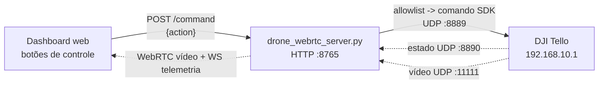

# Controle de Voo do Tello pelo Dashboard Web

## 1. Síntese executiva

&emsp;Esta entrega adiciona o **controle de voo do DJI Tello diretamente pelo dashboard web**. Abaixo do feed de vídeo, na mesma coluna da câmera, passam a existir os botões **Decolar**, **Pousar** e os direcionais de voo **Frente**, **Trás**, **Cima**, **Baixo**, **Esquerda** e **Direita**, um botão **Parar** (paira no lugar) e um modo opcional de **controle por teclado** estilo arcade. Por padrão, a pilotagem é **contínua** (segurar para mover, soltar para pairar); o modo discreto (1 clique = 1 passo) e o teclado arcade ficam como alternativas opt-out (ver seções 4.1, 13 e 13.5).

&emsp;A motivação é operacional: a arquitetura original previa que o drone fosse pilotado por um **operador FPV com controle de rádio**. No ambiente de MVP não temos esse hardware de pilotagem dedicado, então o controle pelo dashboard permite **testar a aplicação da forma como ela seria usada de fato**: o drone voando e o pipeline de visão computacional identificando a placa dos veículos em tempo real.

&emsp;A decisão técnica foi **não expor o Tello diretamente ao browser**. O frontend envia uma ação de alto nível (`up`, `left`, etc.) para o servidor `drone_webrtc_server.py`, que já detém o socket UDP do Tello. O servidor traduz a ação para um comando do SDK por meio de uma **allowlist** e o envia por UDP `8889`. Isso mantém o padrão de rede local/offline já documentado na Sprint 4 e evita que o browser dispare comandos arbitrários ao drone.

## 2. Pergunta, hipótese e decisão

| Item | Registro |
| --- | --- |
| Pergunta | Como pilotar o Tello para o teste de leitura de placas sem o operador FPV e o controle de rádio previstos? |
| Hipótese | O mesmo servidor que já envia `command`/`streamon`/`streamoff` por UDP pode receber ações do dashboard e repassá-las como comandos de movimento do SDK. |
| Contra-tese | Expor o Tello direto ao browser ou aceitar string livre de comando abriria espaço para comando arbitrário, fora da allowlist, e quebraria a separação local/Internet da Sprint 4. |
| Decisão | Criar o endpoint `POST /command` no `drone_webrtc_server.py` com allowlist de ações; o frontend só envia ações nomeadas; esquerda/direita = rotação (yaw); incluir Decolar/Pousar/Parar e um modo arcade de controle por teclado (opt-in). |
| Critério de aceite | Os botões aparecem com o servidor conectado, mesmo sem o drone ativo (exibindo disclaimer); cada botão gera um comando válido do SDK; ação fora da allowlist retorna 400; comando com drone desconectado retorna 409. |
| Métrica observável | `npm run build` do frontend sem erro; `py_compile` do servidor sem erro; em teste de campo, `takeoff` levanta o drone e os direcionais alteram altitude, translação (frente/trás) e yaw. |

## 3. Investigação da documentação do Tello

&emsp;A investigação confirmou, pelo **Tello SDK 2.0 User Guide** e pelo **Tello SDK Documentation EN 1.3** (Ryze/DJI), que o controle é local, por UDP, no Wi-Fi do drone. Os comandos relevantes para esta feature e seus limites são:

| Comando SDK | Função | Faixa válida | Uso nesta feature |
| --- | --- | --- | --- |
| `command` | Entra em modo SDK | — | Já enviado pelo servidor ao iniciar |
| `streamon` / `streamoff` | Liga/desliga o vídeo UDP 11111 | — | Já usado pelo pipeline de vídeo |
| `takeoff` | Decolagem automática | — | Botão **Decolar** |
| `land` | Pouso automático | — | Botão **Pousar** e tecla **Espaço** |
| `up x` / `down x` | Sobe/desce (altitude) | `20`–`500` cm | Botões **Cima** / **Baixo** |
| `forward x` / `back x` | Avança/recua (translação) | `20`–`500` cm | Botões **Frente** / **Trás** |
| `left x` / `right x` | Translada lateralmente | `20`–`500` cm | (alternativa não escolhida — ver seção 4) |
| `cw x` / `ccw x` | Gira no próprio eixo (yaw) | `1`–`360` graus | Botões **Direita** (`cw`) / **Esquerda** (`ccw`) |
| `rc 0 0 0 0` | Zera os 4 controles → paira/para no lugar (funciona em qualquer firmware; o `stop` do SDK 2.0 não é universal — ver seção 12.4) | `-100`–`100` por eixo | Botão **Parar** (ação `stop`) |
| `emergency` | Para os motores imediatamente | — | Não exposto no MVP (ver backlog) |

&emsp;Pontos operacionais relevantes registrados na investigação:

- **Portas:** comandos saem por UDP `8889`; estado (bateria, altura) chega por UDP `8890`; vídeo chega por UDP `11111`. O dashboard fala apenas HTTP/WebSocket `8765` com o servidor local.
- **Auto-pouso por inatividade:** o SDK derruba o drone automaticamente **se não receber nenhum comando por 15 segundos**. Isso afeta o uso prolongado por botões e está registrado nas limitações (seção 9).
- **Pré-requisito de movimento:** os comandos de deslocamento (`up`, `down`, `forward`, `back`, `cw`, `ccw`) só têm efeito **após `takeoff`**. Por isso a decisão incluiu os botões Decolar/Pousar.

## 4. Decisão de mapeamento dos botões

&emsp;Inicialmente o controle por teclado envolvia quatro direcionais "cima, baixo, esquerda e direita, nessa ordem". A ambiguidade estava em **esquerda/direita**: poderiam ser translação lateral (`left`/`right`) ou rotação no eixo (`ccw`/`cw`). A decisão tomada foi manter em **rotação (yaw)**.

| Botão | Ação do frontend | Comando SDK | Justificativa |
| --- | --- | --- | --- |
| Decolar | `takeoff` | `takeoff` | Sem decolar, nenhum comando de movimento funciona. |
| Pousar | `land` | `land` | Encerra o voo com segurança pelo próprio dashboard. |
| Frente | `forward` | `forward 30` | Avança para aproximar do veículo e enquadrar a placa. |
| Trás | `back` | `back 30` | Recua para abrir o campo de visão ou se afastar. |
| Cima | `up` | `up 30` | Ganha altitude para enquadrar a placa de cima. |
| Baixo | `down` | `down 30` | Reduz altitude para aproximar da placa. |
| Esquerda | `left` | `ccw 30` | Gira a câmera para varrer o ambiente e procurar veículos. |
| Direita | `right` | `cw 30` | Gira a câmera no sentido oposto para o mesmo fim. |

&emsp;A rotação foi escolhida porque o objetivo do teste é **encontrar e enquadrar placas**: girar o drone reposiciona a câmera sobre o ambiente de forma mais útil do que apenas transladar lateralmente. As magnitudes padrão (`30` cm e `30` graus) são conservadoras para teste em ambiente fechado e configuráveis por variável de ambiente.

&emsp;Os botões **Frente** e **Trás** (`forward`/`back`) foram adicionados após a primeira rodada de teste em campo: o drone voou e o pipeline leu placas com sucesso, mas faltava deslocamento longitudinal para aproximar/afastar a câmera do veículo. Com eles, o painel cobre os três eixos de controle disponíveis: **deslocamento** (frente/trás), **altitude** (cima/baixo) e **rotação/yaw** (esquerda/direita).

### 4.1 Atalhos de teclado (modo arcade)

&emsp;Para simplificar a pilotagem — a proposta é controlar o drone "como um videogame/arcade" —, o painel oferece um modo opcional de **controle por teclado**, ligado pelo botão **Teclado ON/OFF** no cabeçalho dos controles. Com o modo ligado, as teclas abaixo enviam comandos; com o modo desligado, o teclado volta ao comportamento normal do navegador.

| Tecla | Ação | Comando SDK |
| --- | --- | --- |
| Seta esquerda (←) | Girar para a esquerda | `ccw 30` |
| Seta direita (→) | Girar para a direita | `cw 30` |
| Seta cima (↑) | Frente | `forward 30` |
| Seta baixo (↓) | Trás | `back 30` |
| Shift | Sobe (altitude) | `up 30` |
| Ctrl | Desce (altitude) | `down 30` |
| Espaço | Pousa (encerra o voo) | `land` |

&emsp;O mapeamento segue a intuição de jogos: as **setas** cuidam da navegação no plano horizontal (girar + frente/trás), **Shift/Ctrl** controlam a altitude (acelerador para cima/baixo, comum em simuladores de voo) e o **Espaço** aciona o **pouso** (`land`), um jeito rápido de encerrar o voo pelo teclado. Para apenas pairar no lugar sem pousar, use o botão **Parar** (`rc 0 0 0 0`, ver seção 12.4).

&emsp;**Por que um botão liga/desliga em vez de teclado sempre ativo?** Por dois motivos: (1) **segurança**, evita que uma tecla apertada por engano mova um drone real quando o operador só queria navegar na página; (2) as teclas usadas (setas, `Espaço`, `Ctrl`) também rolam a página e disparam atalhos do navegador, então capturá-las o tempo todo atrapalharia o uso normal do dashboard. Com o modo arcade explícito, fica claro quando o teclado está "pilotando". Cada tecla corresponde a um passo discreto (sem repetição ao segurar); para pilotagem fluida, use o **modo contínuo** (padrão, ver seção 13), em que segurar a tecla/botão mantém o movimento.

## 5. Arquitetura



&emsp;O fluxo de controle reaproveita o mesmo processo que já faz a ponte de vídeo e telemetria. O browser nunca fala UDP com o Tello: ele envia uma ação nomeada e o servidor decide o comando final. Assim, a fronteira local/Internet definida na Sprint 4 permanece intacta.

## 6. Contrato do endpoint `POST /command`

&emsp;Requisição (JSON):

```json
{ "action": "up", "value": 30 }
```

- `action` (obrigatório): uma de `takeoff`, `land`, `up`, `down`, `forward`, `back`, `left`, `right`, `stop`.
- `value` (opcional): magnitude. Para `up`/`down`/`forward`/`back` é tratada em cm e limitada a `20`–`500`; para `left`/`right` é tratada em graus e limitada a `1`–`360`. Se ausente ou inválida, usa o padrão (`30`).
- A ação `stop` é traduzida para `rc 0 0 0 0` (paira/para no lugar). Como o Tello não responde a comandos `rc`, ela é enviada *fire-and-forget* e retorna `200 { ok: true }` sem o campo `response` (ver seção 12.4).

&emsp;Respostas:

| HTTP | Corpo | Quando |
| --- | --- | --- |
| `200` | `{ "ok": true, "action": "up", "command": "up 30", "response": "ok" }` | Ação válida, drone conectado e Tello respondeu `ok`. |
| `400` | `{ "ok": false, "error": "Acao nao permitida: ..." }` | Ação fora da allowlist ou JSON inválido. |
| `409` | `{ "ok": false, "error": "Drone desconectado - comando nao enviado" }` | Servidor sem pacotes de estado recentes (UDP 8890). |
| `502` | `{ "ok": false, "command": "forward 30", "response": "error", "error": "Tello recusou ..." }` | Comando chegou ao Tello, mas o drone respondeu algo diferente de `ok` (ex.: `error`, `out of range`). |
| `504` | `{ "ok": false, "error": "Sem resposta do Tello (timeout)" }` | Tello não respondeu dentro de `TELLO_COMMAND_TIMEOUT` (padrão `12` s). |

&emsp;Para os **comandos de controle**, o servidor agora **aguarda a resposta do Tello** (em executor, até `TELLO_COMMAND_TIMEOUT`) e a reflete no corpo (`response`) e no status HTTP — ver seção 12. Os comandos internos de vídeo (`command`/`streamon`/`streamoff`) e a ação `stop` (`rc 0 0 0 0`, que o Tello não confirma) seguem *fire-and-forget*.

## 7. Mudanças implementadas

| Arquivo | Mudança |
| --- | --- |
| `src/drone_webrtc_server.py` | Novo endpoint `POST /command`; helpers `_build_sdk_command` (allowlist) e `_clamp_int` (limites do SDK); registro de rota + CORS; variáveis `TELLO_MOVE_DISTANCE_CM` e `TELLO_ROTATE_DEGREES`; log de inicialização atualizado. |
| `src/frontend/src/services/droneStream.js` | Nova função `sendDroneCommand(action, value)` que faz `POST` ao servidor WebRTC e trata erros do corpo JSON. |
| `src/frontend/src/screens/OperationsManager.jsx` | Componentes `DroneControls` e `ControlButton` renderizados abaixo da câmera, na mesma coluna (64%); seis direcionais (Frente, Trás, Cima, Baixo, Esquerda, Direita) agrupados por eixo em grid 3x2, mais Decolar/Pousar/Parar e um modo arcade de controle por teclado (setas, Shift, Ctrl, Espaço) com botão liga/desliga; exibidos quando o servidor está conectado (`streamStatus === 'connected'`), mesmo sem o drone ativo, com um disclaimer quando `droneConnected !== true`; feedback de comando e dica de decolagem. |
| `.env.example` | Documenta `TELLO_MOVE_DISTANCE_CM` e `TELLO_ROTATE_DEGREES`; remove marcador de conflito de merge órfão. |

&emsp;Revisão posterior (ver seção 12): `drone_webrtc_server.py` ganhou `_send_command_await` para ler a resposta do Tello nos comandos de controle (em executor, com `TELLO_COMMAND_TIMEOUT`); `OperationsManager.jsx` passou a exibir a resposta real do drone no feedback; `droneStream.js` retorna o campo `response` do servidor. Em seguida, os envios ao Tello passaram a usar um **socket de comando único** (bind na porta `9000` uma vez) protegido por lock, no lugar de reabrir a porta a cada envio, eliminando o `WinError 10048` por re-bind concorrente (startup, retry de vídeo e controle) e serializando os comandos.

&emsp;Revisão posterior (controle contínuo): adicionado o WebSocket `WS /control` no servidor (streaming de `rc a b c d` + watchdog/deadman + stop-on-disconnect), `openControlSocket()` no `droneStream.js` e o modo contínuo no `OperationsManager.jsx` (toggle, segurar-para-mover por teclas/botões, salvaguardas `keyup`/`blur`/aba oculta, burst de zeros ao soltar). Após teste de campo bem-sucedido, o **contínuo passou a ser o modo padrão** (ver seções 13 e 13.5); novas variáveis `TELLO_RC_SPEED_MAX` e `TELLO_RC_WATCHDOG_MS`.

## 8. Segurança e robustez

| Escolha | Risco evitado |
| --- | --- |
| Allowlist de ações no servidor (sem string livre). | Browser ou cliente malicioso enviar comando arbitrário do SDK ao drone. |
| Clamp de magnitude para as faixas do SDK. | Valor fora de `20`–`500` cm / `1`–`360` graus ser recusado pelo Tello ou causar movimento inesperado. |
| Bloqueio com `409` quando o drone não transmite estado. | Comando enviado "no escuro" quando o drone está offline. |
| Botões ocultos quando o servidor está offline; com o servidor up mas drone offline, aparecem com disclaimer e o servidor ainda recusa o comando com `409`. | Operador acionar controle sem link real com o drone (mitigado por aviso + recusa, sem esconder o painel e confundir o operador). |
| Botões desabilitados durante o envio de um comando. | Rajada de comandos por cliques repetidos. |
| Socket de comando único (bind na `9000` uma vez) sob lock, com auto-recuperação e descarte de respostas antigas. | `WinError 10048` por re-bind concorrente da porta exclusiva (startup, retry de vídeo e controle simultâneos) e leitura de uma resposta do Tello como se fosse de outro comando. |
| Watchdog/deadman + stop-on-disconnect + `keyup`/`blur`/aba oculta no modo contínuo (rc). | Runaway do drone se o sinal de "parar" se perder (queda de rede, cliente travado, foco perdido) durante o controle contínuo (ver seção 13). |

## 9. Limitações conhecidas e backlog

1. **Auto-pouso de 15 s:** sem comando por 15 segundos, o Tello pousa sozinho. Backlog: enviar um *keepalive* periódico (`command`) enquanto o drone estiver no ar.
2. **Leitura da resposta do drone (resolvido):** o servidor lê a resposta `ok`/`error` do Tello para comandos de controle e reflete no dashboard e no log (ver seção 12). Os comandos internos de vídeo seguem *fire-and-forget*.
3. **Movimento contínuo (rc) — agora o modo padrão (resolvido):** após teste de campo bem-sucedido, o controle é **contínuo por padrão** (segurar para mover, soltar para pairar) via `rc a b c d`, com watchdog e salvaguardas (ver seções 13 e 13.5). O modo discreto (1 clique = 1 passo) e o teclado arcade seguem disponíveis como alternativas opt-out.
4. **Sem botão de emergência/parada:** `emergency` não foi exposto no MVP. Backlog: avaliar inclusão com confirmação.
5. **Controle por teclado (interruptor de segurança, independente do Contínuo):** opt-in com botão liga/desliga (setas, Shift, Ctrl, Espaço), para não mover o drone por tecla acidental nem sequestrar atalhos/rolagem do navegador. É **ortogonal** ao Contínuo: o estilo das teclas segue o Contínuo (segurar para mover) ou o discreto (1 toque = 1 passo). Os botões direcionais funcionam sempre, independente do Teclado (ver seções 13 e 13.5).

## 10. Rastreabilidade de requisitos

| Hipótese | Evidência | Decisão | Requisito/story | Critério de aceite |
| --- | --- | --- | --- | --- |
| O teste de campo precisa do drone voando sem hardware FPV. | SDK do Tello aceita `takeoff`/`land` e movimentos por UDP. | Controle de voo pelo dashboard com allowlist. | Como operador, quero pilotar o drone pelo painel para testar a leitura de placas. | Botões geram comandos válidos do SDK e o drone responde em campo. |
| O browser não deve falar UDP com o Tello. | Servidor WebRTC já detém o socket do drone. | Endpoint `POST /command` traduz ação em comando. | Como sistema, quero manter a separação local/Internet da Sprint 4. | Frontend só envia ações nomeadas; servidor decide o comando. |
| Comando inválido não pode chegar ao drone. | Allowlist + clamp no servidor. | Recusar ação fora da lista com `400`. | Como operador, quero evitar comandos perigosos por engano. | Ação desconhecida retorna `400` e não envia UDP. |

## 11. Transparência operacional

| Dimensão | Registro |
| --- | --- |
| Branch de trabalho | `feat/controle-drone-frontend` |
| Origem | Criada a partir de `develop`. |
| Escopo da alteração | Endpoint de controle no servidor WebRTC, serviço e UI do frontend, variáveis de ambiente e esta documentação. |
| Evidência local coletada | `npm run build` do frontend executou sem erro (1631 módulos transformados); `python -m py_compile src/drone_webrtc_server.py` retornou sem erro. |
| Teste de campo (1ª rodada) | O operador confirmou que o drone decolou, voou e o pipeline leu placas pelo dashboard. Faltou deslocamento frente/trás, adicionado nesta revisão (`forward`/`back`). |
| Evolução após feedback | A pedido do operador, para simplificar a pilotagem (estilo videogame/arcade), foram adicionados o comando `stop` (botão **Parar**) e o modo de controle por teclado. Posteriormente, a tecla **Espaço** passou a acionar o **pouso** (`land`) a pedido do operador. |
| Limite de validação | Sem o Tello ligado, a validação cobre build, compilação e contrato do endpoint. O voo real (decolagem, alteração de altitude/yaw e leitura de placa em movimento) precisa de teste de campo com o drone e o preflight de rede da Sprint 4. |
| Correção após 2ª rodada de campo | Operador relatou frente/trás pouco responsivos e questionou se era transmissão. Diagnóstico: não é transmissão (mesmo caminho de código e magnitude de cima/baixo); causas prováveis VPS/fluxo óptico, distância curta e rejeição mascarada pelo *fire-and-forget*. Ação: leitura da resposta do Tello nos comandos de controle (seção 12). |
| Próxima decisão | Validar em campo `forward`/`back` sobre piso texturizado observando a resposta do Tello no painel; avaliar o keepalive de 15 s e o controle contínuo `rc`. |

## 12. Problema em campo: frente/trás pouco responsivos

&emsp;Em teste de campo posterior, o operador relatou que **os comandos Frente e Trás ficavam pouco responsivos** ("o drone não se mexe ou mexe pouco"), enquanto os demais controles (giro, cima/baixo, decolar/pousar) respondiam normalmente. A dúvida levantada foi se era **problema de transmissão**.

### 12.1 Diagnóstico

&emsp;**Não é problema de transmissão.** Se o canal de comando UDP `8889` estivesse falhando, *todos* os comandos falhariam (giro, altitude, decolar/pousar) e a telemetria/vídeo também cairiam. Como o restante respondia, o envio estava intacto. Além disso, o código trata `forward`/`back` exatamente como `up`/`down`: o frontend envia a ação sem `value` e o servidor gera `forward 30`/`back 30`, **a mesma magnitude (30 cm)** de `up 30`. Mesmo caminho de código e mesma distância, o que muda é apenas o **eixo do movimento**.

&emsp;Causas prováveis, em ordem de probabilidade:

- **Vision Positioning System (VPS):** frente/trás é translação horizontal, estabilizada pela câmera inferior (fluxo óptico). Em piso liso/reflexivo/sem textura ou com pouca luz, o firmware do Tello reduz ou recusa a translação. Giro (yaw) e altitude dependem muito menos do fluxo óptico horizontal, por isso continuam funcionando.
- **Distância curta (30 cm):** sem referência visual, um avanço de 30 cm parece "não mexeu", enquanto um giro de 30 graus e uma subida de 30 cm são bem mais perceptíveis.
- **Rejeição silenciosa:** o envio era *fire-and-forget*; o dashboard mostrava "Comando enviado" mesmo quando o Tello respondia `error`/`out of range`, mascarando uma eventual recusa do drone.

### 12.2 Ação tomada: ler a resposta real do Tello

&emsp;Para fechar o diagnóstico (saber se o drone aceita ou recusa frente/trás), o servidor passou a **ler a resposta do Tello** nos comandos de controle, resolvendo o item de backlog "Sem ACK do drone":

- Novo `_send_command_await(cmd, timeout)` em `drone_webrtc_server.py`: envia o comando e aguarda a resposta na porta UDP `9000` (`ok`, `error`, `out of range`...). O timeout cobre a duração da manobra, pois movimentos e `takeoff`/`land` só respondem `ok` **após concluir** a ação; é configurável por `TELLO_COMMAND_TIMEOUT` (padrão `12` s).
- `handle_command` executa o envio **em executor** (`run_in_executor`), para não travar o event loop do aiohttp enquanto a manobra termina, e devolve a resposta crua do drone no campo `response`.
- O dashboard passa a exibir a resposta real: `Frente: Tello respondeu "ok"` quando aceito, ou `Tello recusou 'forward 30': <resposta>` quando recusado.

&emsp;Com isso, "comando enviado" deixa de ser confundido com "comando executado": se o Tello responder `ok` e ainda assim mal se mover, confirma-se a hipótese de VPS/distância; se responder `error`, o problema está na recusa do drone (bateria, modo de voo ou valor), agora visível no painel e no log.

&emsp;Evidência local desta revisão: `python -m py_compile src/drone_webrtc_server.py` retornou sem erro.

### 12.3 Comando "Parar" (stop) não reconhecido pelo Tello

&emsp;Com a leitura de resposta já ativa (seção 12.2), o operador notou que o botão **Parar** retornava erro: o Tello respondia algo diferente de `ok` ao comando `stop`. Causa: **`stop` é um comando do SDK 2.0** e não existe no SDK 1.3; firmwares antigos respondem `unknown command`/`error`.

&emsp;Ação: a ação `stop` passou a ser traduzida para **`rc 0 0 0 0`** (os quatro controles em neutro), que faz o Tello pairar/parar e **funciona em qualquer firmware**. Como o Tello **não responde** a comandos `rc`, o endpoint envia esse comando *fire-and-forget* (sem aguardar resposta, em executor para não competir pelo lock do socket) e retorna `200 { ok: true }`; o dashboard exibe "Comando enviado: Parar". O tratamento é genérico para qualquer comando iniciado por `rc `, o que abriu caminho para o controle contínuo estilo joystick, hoje o modo padrão (ver seção 13).

## 13. Controle contínuo (rc): Modo padrão

&emsp;O controle tem **dois interruptores independentes** no cabeçalho (clicar em um não desliga o outro):

- **Contínuo ON/OFF** (ligado por padrão) define o *estilo* de movimento: ligado, **segurar move** (`rc a b c d`, joystick virtual; o Tello não responde a ele) e soltar paira; desligado, cada ação é **um passo discreto** (1 clique/tecla = 1 passo). Vale para os botões direcionais **e** para o teclado.
- **Teclado ON/OFF** (desligado por padrão) habilita pilotar pelas **teclas** (setas, Shift, Ctrl, Espaço); o estilo segue o Contínuo. Os **botões** direcionais funcionam sempre, independente do Teclado.

&emsp;Como são ortogonais, qualquer combinação vale (ex.: Contínuo ON + Teclado ON = teclas e botões em segurar-para-mover). O Teclado é um interruptor de segurança: por padrão, uma tecla apertada por engano não move o drone.

### 13.1 Como funciona

- **Transporte:** WebSocket dedicado `WS /control` (em vez de `POST /command` por clique). O front envia, a ~12 Hz, o vetor `{ lr, fb, ud, yaw }` (cada eixo -100..100); o servidor traduz para `rc a b c d` e envia *fire-and-forget*.
- **Mapeamento (igual ao arcade):** setas = frente/trás e giro (yaw); Shift/Ctrl = sobe/desce; os botões direcionais viram "segurar para mover". Velocidade padrão conservadora (`RC_SPEED = 40%`).
- **Soltar = pairar:** ao soltar, o front envia `rc 0 0 0 0`.

### 13.2 Salvaguardas contra perda de controle

&emsp;O contínuo **não é fail-safe por natureza** (o drone segue na última direção até receber "parar"). Por isso há várias camadas:

| Camada | O que faz |
| --- | --- |
| **Watchdog/deadman no servidor** | Se o drone está em movimento e o servidor fica `TELLO_RC_WATCHDOG_MS` (padrão 400 ms) sem receber `rc`, envia `rc 0 0 0 0` (paira). Pega queda de rede/cliente travado. |
| **Stop-on-disconnect** | Ao fechar o WebSocket `/control`, o servidor envia `rc 0 0 0 0`. |
| **`keyup` + `blur` + aba oculta** | O front zera os controles quando a tecla é solta, quando a janela perde foco e quando a aba fica em segundo plano (evita comando "grudado"). |
| **Limite de velocidade** | Magnitude conservadora no front (`RC_SPEED`) e teto no servidor (`TELLO_RC_SPEED_MAX`). |
| **Burst de zeros ao soltar** | O front envia alguns `rc 0 0 0 0` após soltar para garantir a parada mesmo com perda de pacote. |
| **Timer próprio (não key-repeat)** | O envio usa `setInterval` (~80 ms), não o auto-repeat do SO. |

&emsp;Quando ocioso (nada pressionado), o front **para de enviar** rc, preservando o auto-pouso de 15 s do SDK como última rede de segurança.

### 13.3 Contrato do WebSocket `/control`

- Cliente → servidor (texto JSON, alta frequência): `{ "lr": 0, "fb": 40, "ud": 0, "yaw": 30 }` (cada eixo -`TELLO_RC_SPEED_MAX`..`TELLO_RC_SPEED_MAX`).
- Servidor: traduz para `rc lr fb ud yaw` e envia ao Tello; não responde mensagens (o Tello não confirma `rc`).
- `takeoff`/`land`/`Parar` continuam discretos via `POST /command`.

### 13.4 Variáveis de ambiente

```env
TELLO_RC_SPEED_MAX=100        # teto de magnitude por eixo
TELLO_RC_WATCHDOG_MS=400      # deadman: pairar após esse silêncio em movimento
VITE_DRONE_CONTROL_WS_URL=ws://localhost:8765/control
```

### 13.5 Decisão: contínuo como modo padrão

&emsp;Após o teste de campo (jun. 2026), o modo contínuo se mostrou mais fluido e intuitivo para pilotar e enquadrar as placas do que o discreto (1 clique = 1 passo). Por isso ele passou a ser o **modo padrão** do painel: em `DroneControls`, o estado `continuousEnabled` inicia em `true` e as salvaguardas da seção 13.2 ficam ativas desde a abertura dos controles.

&emsp;O modo discreto e o teclado arcade permanecem como **alternativas opt-out** (botões do cabeçalho), preservando passos precisos quando necessário. A mudança **não reduz a proteção contra runaway**: o watchdog/deadman do servidor, o stop-on-disconnect e os gatilhos `keyup`/`blur`/aba oculta continuam valendo, e quando ocioso o front não envia `rc` (preservando o auto-pouso de 15 s do SDK).

## 14. Fontes

- Ryze Robotics / DJI. **Tello SDK 2.0 User Guide**. Disponível em: https://dl-cdn.ryzerobotics.com/downloads/Tello/Tello%20SDK%202.0%20User%20Guide.pdf. Acesso em: 22 jun. 2026.
- Ryze Robotics / DJI. **Tello SDK Documentation EN 1.3**. Disponível em: https://dl-cdn.ryzerobotics.com/downloads/tello/20180910/Tello%20SDK%20Documentation%20EN_1.3.pdf. Acesso em: 22 jun. 2026.
- DJITelloPy. **Tello API Reference**. Disponível em: https://djitellopy.readthedocs.io/en/latest/tello/. Acesso em: 22 jun. 2026.
